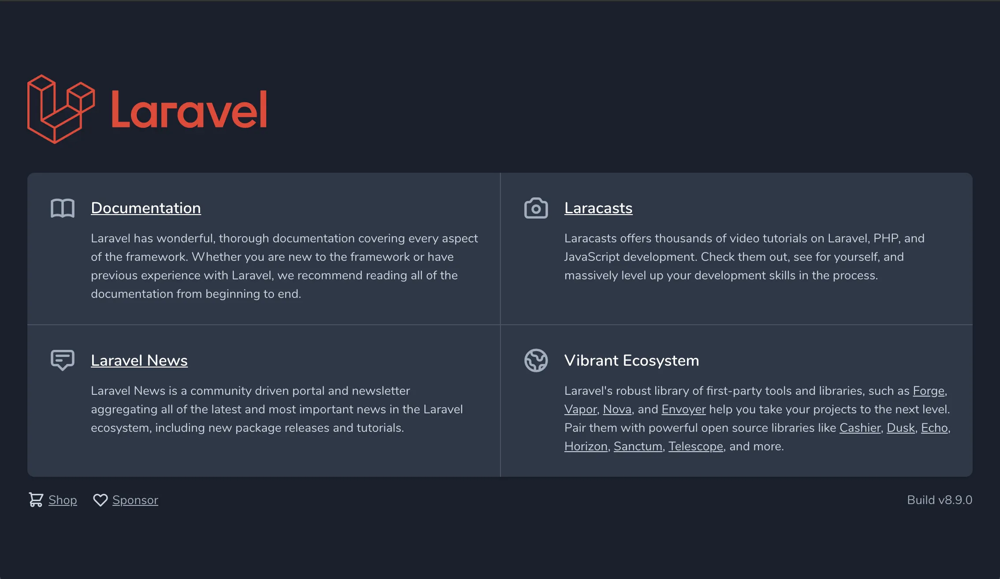

# 🚀 Laravelプロジェクトを立ち上げよう（Welcome画面まで）

## 🎯 本パートの目標物

以下のように **LaravelのWelcome画面** がブラウザで表示される状態を目指します。

> 💡 これが表示されれば、Laravelの環境構築は成功です！
> 



---

## 🧭 手順の流れ

1. Laravel用のDocker環境を立ち上げる
2. LaravelのPHPコンテナに入る
3. コンテナ内でLaravelプロジェクトを作成
4. ブラウザでアクセスし、Welcome画面を確認

---

## 🐳 1. LaravelのDockerを立ち上げる

まず、`memo-laravel` ディレクトリに移動します。

```bash
cd memo-laravel
```

---

次に、Laravel用のDocker環境を起動します。

```
docker-compose up -d --build
```

※ もし初めて立ち上げる場合は、**イメージのビルドや依存関係のダウンロードに少し時間がかかります。**

---

## **🧩 2. Dockerコンテナに入る**

LaravelのPHPコンテナに入って、そこで作業を行います。

```
docker-compose exec php bash
```

実行すると、下記のような状態になります。

```
root@de4777a86bb5:/var/www/html#
```

---

## **🧱 3. Laravelプロジェクトを作成する**

次に、Composerを使ってLaravelのプロジェクトを作成します。

```
composer create-project laravel/laravel=8.1.0 .
```

### **🧠 補足**

- laravel/laravel=8.1.0 → Laravelのバージョンを指定

このコマンドを実行すると、Laravel本体と関連パッケージが一括でインストールされます。

処理中には以下のような出力が流れます。

```
Creating a "laravel/laravel=8.1.0" project at "./simple_memo_laravel"
Installing laravel/laravel (v8.1.0)
...
> @php artisan key:generate --ansi
Application key set successfully.
```

最後に

**Application key set successfully.**

が表示されれば、プロジェクト作成は成功です。

---

## **📂 4. ディレクトリ構成を確認する**

作成したディレクトリに移動します。

```
cd src
```

次に ls コマンドで中身を確認します。

```
ls
```

出力例：

```
README.md  bootstrap  config  phpunit.xml  routes  tests
app        composer.json  database  public  server.php  vendor
artisan    composer.lock  package.json  resources  storage  webpack.mix.js
```

このように、Laravelの典型的な構成ファイル群が作成されていればOKです。

---

## **🌐 5. ブラウザで動作確認**

ブラウザを開いて以下にアクセスします。

👉 **http://127.0.0.1:8085/**

すると、以下のようなWelcome画面が表示されます。

> ※ PCの設定（OSやブラウザのダークモード設定）によって背景色が異なる場合があります。
> 


---

## **🔚 6. コンテナから抜ける**

作業が終わったら、Dockerコンテナから抜けてローカル環境に戻ります。

```
exit
```

これで、コンテナの外（あなたのPC側）に戻れます。

---

## **🎉 まとめ**

- ✅ Docker環境を立ち上げた
- ✅ LaravelプロジェクトをComposerで作成
- ✅ ブラウザからWelcome画面を確認
- ✅ コンテナを安全に終了
