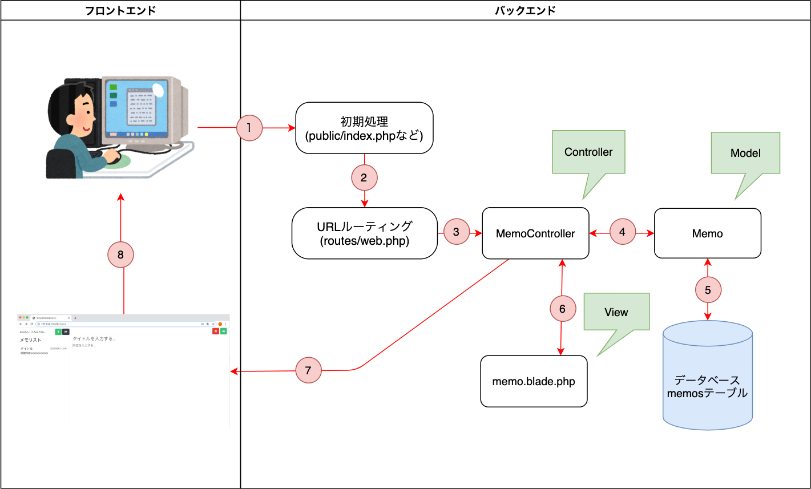

# 📂 Laravelのディレクトリ構成と処理の流れを理解しよう

## 🎯 本パートの目標

Laravelのプロジェクトに自動で作成されたディレクトリやファイルの意味を理解し、  
「どのファイルにどんな処理を書くのか」が分かるようになります。

---

## 🧱 Laravelのディレクトリ構成（2階層）
```
├── app
│   ├── Console
│   ├── Exceptions
│   ├── Http
│   ├── Models
│   └── Providers
├── bootstrap
│   ├── app.php
│   └── cache
├── config
│   ├── app.php
│   ├── auth.php
│   ├── broadcasting.php
│   ├── cache.php
│   ├── cors.php
│   ├── database.php
│   ├── filesystems.php
│   ├── hashing.php
│   ├── logging.php
│   ├── mail.php
│   ├── queue.php
│   ├── services.php
│   ├── session.php
│   └── view.php
├── database
│   ├── factories
│   ├── migrations
│   └── seeders
├── public
│   ├── css
│   ├── favicon.ico
│   ├── index.php
│   ├── js
│   ├── mix-manifest.json
│   ├── robots.txt
│   └── web.config
├── resources
│   ├── css
│   ├── js
│   ├── lang
│   ├── sass
│   └── views
├── routes
│   ├── api.php
│   ├── channels.php
│   ├── console.php
│   └── web.php
├── storage
│   ├── app
│   ├── framework
│   └── logs
├── tests
├── vendor
```
---

## 📚 各ディレクトリの役割

| ディレクトリ | 役割・説明 |
|---------------|-------------|
| **app** | Laravelのメインロジック（バックエンド処理）。コントローラは`app/Http/Controllers`、モデルは`app/Models`に配置。 |
| **bootstrap** | フレームワークの初期設定やキャッシュ関連。通常は触らない。 |
| **config** | 各種設定ファイル（DB接続、メール、ログ設定など）。環境に合わせて調整可能。 |
| **database** | データベース関連（マイグレーション・シーダー・ファクトリ）。`artisan migrate`でここからテーブルを作成。 |
| **public** | ブラウザから直接アクセス可能な静的ファイル（CSS・JS・画像など）。 |
| **resources** | 静的ファイルの元データ（Bladeテンプレート、CSS/JSのソース、言語ファイル）。特によく使うのは`resources/views`。 |
| **routes** | ルーティング（URLと処理の紐づけ）を定義する。通常は`routes/web.php`を使用。 |
| **storage** | アプリで生成したファイルやログを保存。エラー時は`storage/logs/laravel.log`を確認。 |
| **tests** | コードの自動テストを配置する（本教材では未使用）。 |
| **vendor** | Composerでインストールしたパッケージが格納される。Laravel本体もここに含まれる。 |

---

## ⚙️ Laravelでのリクエスト処理の流れ

下記のような流れで、ブラウザからのアクセスが処理されます。

例）ブラウザから **`http://localhost:8085/memo`** にアクセスした場合  
（ログイン済みの想定）




---

### 🧩 1. 初期処理（Bootstrap）
ブラウザからのリクエストを受けて、Laravelの初期設定・環境読み込みが行われます。  
その後、**URLルーティング**の処理へ進みます。

---

### 🌐 2. URLルーティング（`routes/web.php`）
リクエストされたURLを判定し、実行すべきコントローラーを決定します。

```php
// routes/web.php
Route::get('/memo', 'MemoController@index')->name('memo.index');
```

➡ /memo にアクセスしたとき、MemoController の index() メソッドを呼び出す設定です。

---

# 🧠 3. コントローラーにアクセス（app/Http/Controllers）

ルートで指定されたコントローラーに処理が渡されます。

class MemoController extends Controller {
    public function index() {
        // モデルを呼び出してデータ取得
        $memos = Memo::all();
        // ビューに渡して表示
        return view('memo.index', compact('memos'));
    }
}


---

# 💾 4. モデルにアクセス（app/Models）

コントローラーからモデルを経由してデータベースへアクセスします。

class Memo extends Model {
    protected $table = 'memos';
}


---

# 🗃️ 5. テーブルからデータを取得

Eloquent ORM（Laravel標準のDB操作機能）を通して、
memos テーブルから必要なデータを取得します。

---

# 🧭 6. ビューにデータを渡す（resources/views）

コントローラーで取得したデータを、Bladeテンプレートに渡します。

return view('memo.index', ['memos' => $memos]);

{{-- resources/views/memo/index.blade.php --}}
@foreach ($memos as $memo)
    <p>{{ $memo->title }}</p>
@endforeach


---

# 🖥️ 7. ブラウザへレスポンスを返す

Bladeで生成されたHTMLがレスポンスとしてブラウザに返され、
メモ一覧が画面に表示されます。

---

# 🧩 MVCの関係とLaravelでの配置場所

役割	Laravelでの配置場所	説明
Model	app/Models	データベースとのやり取りを担当
View	resources/views	画面表示（HTML＋Blade構文）を担当
Controller	app/Http/Controllers	リクエストを受け、ModelとViewを繋ぐ


---

# 🔄 処理のイメージ図

Browser
   ↓
 Route（routes/web.php）
   ↓
 Controller（app/Http/Controllers）
   ↓
 Model（app/Models）
   ↓
 Database（memosテーブル）
   ↑
 View（resources/views）
   ↑
 BrowserにHTMLを返す


---

# 💡 まとめ
- Laravelではディレクトリの役割が明確に分かれており、MVC構造に基づいて開発を行う。
- Controllerが中心となり、Modelでデータを取得し、Viewで表示する。
- routes/web.php でURLと処理の関連付けを行う。
- ログやエラーは storage/logs/laravel.log に出力される。


