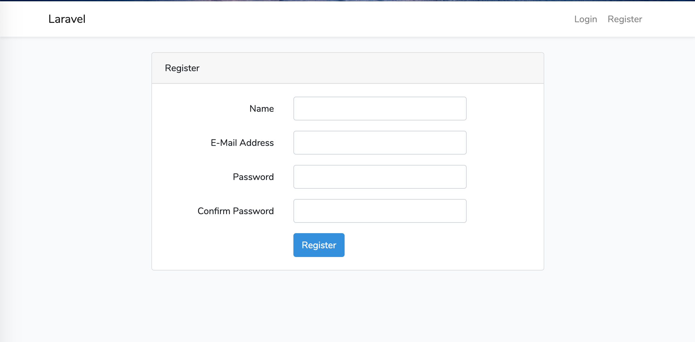
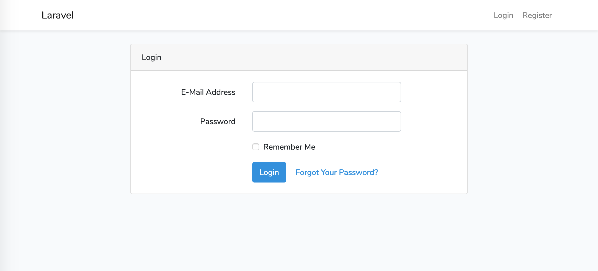
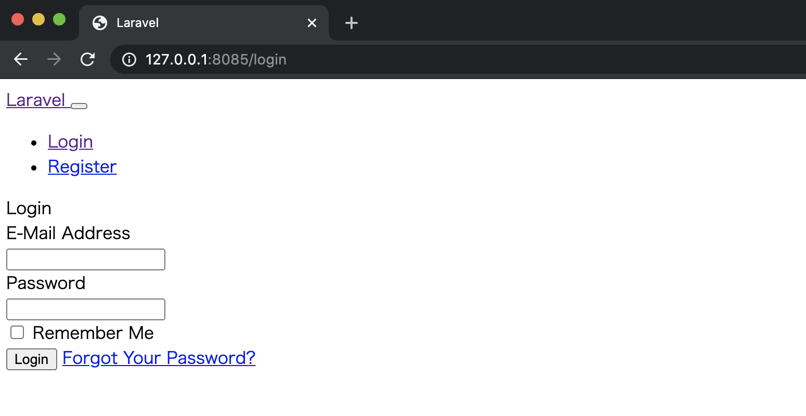

# 🔐 Laravelに認証機能（ログイン・ユーザー登録）を追加しよう

## 🎯 本パートの目標物

以下のような **ログイン画面** と **ユーザー登録画面** が表示される状態を目指します。





---

## 🧭 手順の流れ

1. Dockerコンテナに入る  
2. 認証機能を追加するパッケージをインストールする  
3. 認証UIを作成するコマンドを実行する  
4. npmでフロントエンド資産をビルドする  
5. ブラウザで表示を確認する  

---

## 🐳 1. Dockerコンテナに入る

まだ入っていない場合は、Laravel用のDockerコンテナに入ります。

```bash
docker-compose exec php bash
```

---

⚙️ 2. Laravel認証機能パッケージを追加

Laravelが用意している認証機能を利用するため、laravel/ui パッケージをインストールします。

```bash
composer require laravel/ui "^3.0"
```

実行結果の一部（省略）：

./composer.json has been updated
Loading composer repositories with package information
...
Authentication scaffolding generated successfully.

💡 補足
	•	composer require は指定パッケージをプロジェクトに追加するコマンドです。
	•	"laravel/ui": "^3.0" が composer.json に追記されます。
	•	^3.0 は 「3系の最新安定バージョンを取得」 の意味です。

参考リンク：
	•	Composer - Caret Version Range
	•	Laravel UI パッケージ公式

---

🧩 3. 認証機能のテンプレートを生成

次のコマンドで ui コマンドのヘルプを確認してみましょう。

```bash
php artisan ui -h
```

出力の一部：
```
Description:
  Swap the front-end scaffolding for the application

Arguments:
  type                   The preset type (bootstrap, vue, react)
Options:
      --auth             Install authentication UI scaffolding
```
ここで --auth オプションを使うと、認証機能に必要なファイル群を生成できます。

今回は Vue.js テンプレート を選択して認証UIを生成します。


```bash
php artisan ui vue --auth
```

出力：
```
Vue scaffolding installed successfully.
Please run "npm install && npm run dev" to compile your fresh scaffolding.
Authentication scaffolding generated successfully.
```
---

# 📁 4. 生成された認証ファイルを確認

## 🧱 コントローラー（バックエンド側）

app/Http/Controllers/Auth に以下のファイルが追加されています。

- ConfirmPasswordController.php
- ForgotPasswordController.php
- LoginController.php
- RegisterController.php
- ResetPasswordController.php
- VerificationController.php

各種ログイン・登録・パスワードリセットなどの制御を担当します。

---

## 🖋 ビュー（フロントエンド側）

resources/views/auth 配下には、以下のファイルが追加されています。

- login.blade.php
- register.blade.php
- verify.blade.php
- passwords/confirm.blade.php
- passwords/email.blade.php
- passwords/reset.blade.php

これらは先ほどのコントローラーと連携して動作します。

---

# 🌐 5. 画面を確認する（ビルド前）

一度、ブラウザで下記URLにアクセスしてみましょう。

👉 http://127.0.0.1:8085/login


CSSがまだビルドされていないため、見た目は崩れています。
次に、フロントエンド資産をビルドして整えます。

---

# 🧱 6. npmでフロントエンドをビルド

```bash
npm install && npm run dev
```

💡 処理の流れ
	•	npm install → Node.js関連ライブラリのインストール
	•	npm run dev → webpack.mix.jsをもとにpublic/cssとpublic/jsへビルド

出力例：
```
DONE  Compiled successfully in 19437ms

       Asset      Size   Chunks             Chunk Names
/css/app.css   178 KiB  /js/app  [emitted]  /js/app
/js/app.js    1.41 MiB  /js/app  [emitted]  /js/app
```
これで、CSSとJavaScriptファイルが生成されました。

---

# 🌈 7. 画面を確認（ビルド後）

再びブラウザで確認してみましょう。

👉 http://127.0.0.1:8085/login

綺麗にスタイルが当たったログイン画面が表示されました。

右上の Register をクリックすると、ユーザー登録画面が表示されます。


---

# 🎉 まとめ

手順	内容	結果
①	laravel/ui パッケージを追加	認証機能のベース導入
②	php artisan ui vue --auth 実行	認証用コントローラ・ビュー生成
③	npm install && npm run dev	CSS・JSのビルド
✅	ブラウザで確認	ログイン・登録画面が完成！
