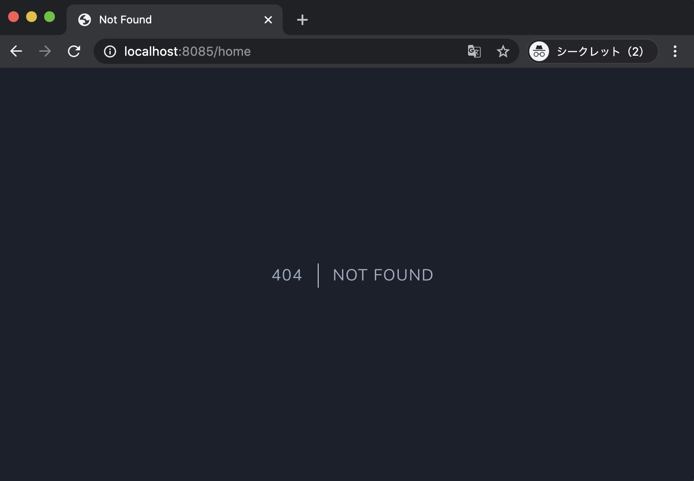
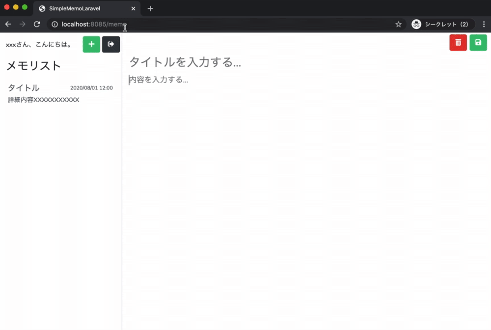
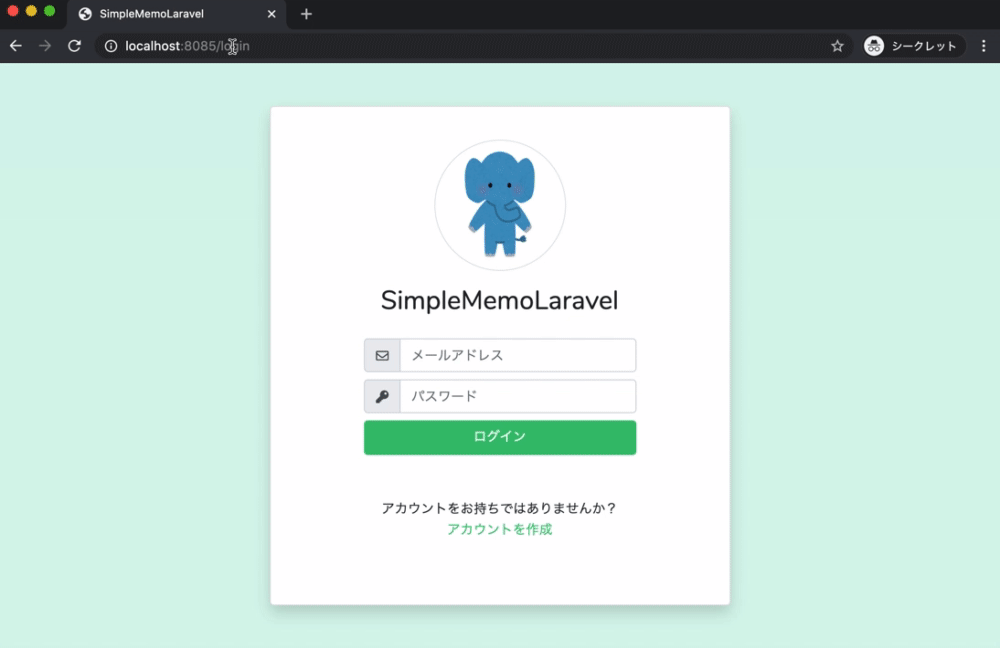

# ログイン情報を考慮した画面遷移を実装する

このパートでは、**ログイン状態に応じて表示してよい画面／表示してはいけない画面をコントロール**できるようにします。

---

## ❓ 現状の問題

ログイン後にブラウザから `/login` や `/user` にアクセスすると、次のように **404 エラー画面** が表示されてしまいます。



これは次の 2 点が原因です。

1. **Middleware（`RedirectIfAuthenticated`）の設定**

   * ログイン済みユーザーがログイン画面・ユーザー登録画面にアクセスした場合、
     「標準のホーム画面（`/home`）」へリダイレクトする仕様になっている

2. **`/home` のルートが存在しない**

   * `resources/views/home.blade.php` はあるが、
     それを表示するルートが `routes/web.php` に定義されていないため 404 になる

そこで本パートでは、

* **ログイン済みのユーザーがログイン画面・ユーザー登録画面に入れないようにする**
* **未ログインユーザーがメモ投稿画面にアクセスできないようにする**

という **認証状態を考慮した画面遷移** を実装していきます。

---

## 🎯 本パートの目標物

### ✅ ログインしている場合

ログイン済みユーザーが次の URL にアクセスした場合…

* `/login`
* `/user`（ユーザー登録画面）

→ どちらも **メモ投稿画面（`/memo`）へリダイレクト** されるようにする



---

### ✅ ログインしていない場合

未ログインで次の URL にアクセスした場合…

* `/memo`

→ **ログイン画面に強制的に戻される** ようにする



---

## 全体の実装フロー

1. 認証ルーティング（`Auth::routes()`）の挙動を確認する
2. **Middleware**（`RedirectIfAuthenticated`）を修正する
3. ログイン済みで `/login`・`/user` にアクセスした際の挙動を確認
4. **ルーティングファイル（`routes/web.php`）を修正**し `/memo` に `auth` ミドルウェアを適用
5. 未ログイン状態で `/memo` にアクセスした際の挙動を確認
6. **ユーザー登録コントローラー**を修正し、登録後すぐにログイン状態にする
7. ユーザー登録後の挙動を確認
8. 併せて Laravel の **デバッグ方法（`dd` / `logger`）** も確認する

---

## 1. Laravel 認証機能のルーティングを確認する

`routes/web.php` には、ログインやログアウトなどのルートを直接書いていませんが、

```php
Auth::routes();
```

という 1 行によって、**認証機能一式のルーティングが自動的に定義**されています。

### 1-1. route:list でルーティング一覧を確認

Docker コンテナ内に入ります。

```shell
docker-compose exec php bash
```

ルーティング一覧を表示します。

```shell
php artisan route:list
```

すると、`/` や `/login` など、認証系のルートが登録されていることが確認できます。

* `Method: GET`
* `URI: /`
* `Action: App\Http\Controllers\Auth\LoginController@showLoginForm`

などのように表示されていれば OK です。
**`/` と `/login` のどちらからでもログイン画面にアクセスできる** のは、このルーティングのおかげです。

---

### 1-2. Auth::routes() をコメントアウトすると？

試しに `routes/web.php` の `Auth::routes();` をコメントアウトして、もう一度 `php artisan route:list` を実行すると、認証関連のルートが消えていることが確認できます。

```php
// Auth::routes();
```

この状態では、**ログイン POST 処理なども使えなくなる** ため、確認が終わったら元に戻しておきましょう。

```php
Auth::routes();
```

> `php artisan route:list` は、
> 「**今どういうルートが定義されているか**」を確認したいときにとても便利なので、覚えておきましょう。

---

## 2. Middleware（RedirectIfAuthenticated）を修正する

次に、**ログイン済みのユーザーがログイン画面・ユーザー登録画面にアクセスしたときの挙動**を変更します。

### 2-1. RedirectIfAuthenticated を編集

`app/Http/Middleware/RedirectIfAuthenticated.php` を開きます。

```php
public function handle(Request $request, Closure $next, ...$guards)
{
    $guards = empty($guards) ? [null] : $guards;

    foreach ($guards as $guard) {
        if (Auth::guard($guard)->check()) {
            // ----- ここから変更する -----
            return redirect(RouteServiceProvider::HOME);
            // ----- ここまで変更する -----
        }
    }

    return $next($request);
}
```

この `return redirect(RouteServiceProvider::HOME);` を、**メモ投稿画面 `/memo` に変更**します。

```php
public function handle(Request $request, Closure $next, ...$guards)
{
    $guards = empty($guards) ? [null] : $guards;

    foreach ($guards as $guard) {
        if (Auth::guard($guard)->check()) {
            // ログイン済みなら /memo へリダイレクト
            return redirect('/memo');
        }
    }

    return $next($request);
}
```

### 2-2. この Middleware の役割

* `$guards` にはガード名が渡されます（このアプリでは常に `null`）
* `Auth::guard($guard)->check()`
  → ログインしていれば `true`、していなければ `false`
* `true` の場合は、**ログイン済みとして `/memo` にリダイレクト**

このミドルウェアは

* `LoginController` のコンストラクタ
* `RegisterController` のコンストラクタ

で `guest` ミドルウェアとして指定されています。

```php
// LoginController
public function __construct()
{
    $this->middleware('guest')->except('logout');
}

// RegisterController
public function __construct()
{
    $this->middleware('guest');
}
```

`guest` ミドルウェアは `app/Http/Kernel.php` で `RedirectIfAuthenticated` に紐付いています。

```php
protected $routeMiddleware = [
    // ...
    'guest' => \App\Http\Middleware\RedirectIfAuthenticated::class,
    // ...
];
```

つまり、

* **ログイン・新規登録画面にアクセス**
* → `guest` ミドルウェア（= `RedirectIfAuthenticated`）が毎回実行
* → ログイン済みであれば `/memo` に飛ばされる

という流れになっています。

---

### 💡 Middleware とは？

ミドルウェアは、**リクエストの前処理・後処理を行うための仕組み**です。

* 前処理の例（今回のようなパターン）

```php
class BeforeMiddleware
{
    public function handle($request, Closure $next)
    {
        // コントローラに行く前に何かする

        return $next($request); // ここで次の処理へ（ルート・コントローラなど）
    }
}
```

* 後処理の例

```php
class AfterMiddleware
{
    public function handle($request, Closure $next)
    {
        $response = $next($request);

        // レスポンスを返す前に何かする

        return $response;
    }
}
```

今回修正した `RedirectIfAuthenticated` は、**「ログイン済みの人はログイン・登録画面に来ないでね」**という前処理のミドルウェアです。

---

## 3. ログイン済みで /login /user にアクセスしたときの挙動確認

1. `http://localhost:8085` からログインする
   （すでにログイン済みなら、一度ブラウザを閉じて開き直すと確実です）
2. ログイン後にブラウザの URL を手入力で `/login` に変更
3. 同様に `/user` に変更

いずれの場合も、**メモ投稿画面（`/memo`）にリダイレクトされる**ことが確認できれば OK です。

> （image from Gyazo）

---

## 4. 未ログイン時に /memo にアクセスできないようにする

次は逆に、**未ログイン状態でメモ投稿画面が見れてしまう問題**を解決します。

### 4-1. 現状のルート

`routes/web.php` を開くと、以下のようになっているはずです。

```php
Route::get('/user', 'App\Http\Controllers\Auth\RegisterController@showRegistrationForm')->name('user.register');
Route::post('/user/register', 'App\Http\Controllers\Auth\RegisterController@register')->name('user.exec.register');

Route::get('/memo', function() {
    return view("memo");
})->name('memo.index');

Auth::routes();
```

このままだと、**ログインしていなくても `/memo` にアクセスできてしまう**状態です。

---

### 4-2. /memo に auth ミドルウェアを適用する

`/memo` を `Route::group` で囲み、`auth` ミドルウェアを適用します。

```php
Route::get('/user', 'App\Http\Controllers\Auth\RegisterController@showRegistrationForm')->name('user.register');
Route::post('/user/register', 'App\Http\Controllers\Auth\RegisterController@register')->name('user.exec.register');

// ---- ここから変更する ----
Route::group(['middleware' => ['auth']], function() {
    Route::get('/memo', function() {
        return view("memo");
    })->name('memo.index');
});
// ---- ここまで変更する ----

Auth::routes();
```

> 今は 1 つだけですが、6 章以降で「メモ追加」「メモ更新」などの URL も同じグループに追加していく前提で group を使っています。

### 4-3. auth ミドルウェアの中身

`auth` は `app/Http/Kernel.php` で `Authenticate` クラスに紐付いています。

```php
protected $routeMiddleware = [
   'auth' => \App\Http\Middleware\Authenticate::class,
   // ...
];
```

`app/Http/Middleware/Authenticate.php` を開くと、未ログイン時のリダイレクト先が定義されています。

```php
protected function redirectTo($request)
{
    if (! $request->expectsJson()) {
        return route('login');
    }
}
```

* ログインしていない状態で `/memo` にアクセス
* → `auth` ミドルウェアで未認証と判定
* → `route('login')`（= ログイン画面）にリダイレクト

という流れになります。

---

## 5. 未ログインで /memo にアクセスしたときの動作確認

### パターン 1：ログイン画面から

1. ログアウトした状態で `http://localhost:8085/login` にアクセス
2. ブラウザの URL を `http://localhost:8085/memo` に変更してアクセス

→ 自動的に **`/login` に戻されること** を確認します。


---

### パターン 2：ユーザー登録画面から

1. ログアウトした状態で `http://localhost:8085/user` にアクセス
2. ブラウザの URL を `http://localhost:8085/memo` に変更してアクセス

→ 同じく **ログイン画面に戻ること** を確認します。


---

## 6. ユーザー登録後に自動ログインできるようにする

ここまでの変更により、**未ログイン状態では `/memo` に行けなくなりました**。

その副作用として、ユーザー登録時の処理がこうなっています：

* ユーザー登録で `/memo` にリダイレクト
* しかし “ログインしていないので” auth ミドルウェアに弾かれて `/login` に戻される

つまり、**登録直後なのにメモ投稿画面に入れない** 状態になっています。

これを修正し、**登録後はそのままログイン状態にして `/memo` を表示できるようにします。**

---

### 6-1. RegisterController の register メソッドを修正

`app/Http/Controllers/Auth/RegisterController.php` を開きます。

現在はこんな形になっているはずです。

```php
public function register(UserCreateRequest $request)
{
    User::create([
        'name' =>  $request->name,
        'email' => $request->email,
        'password' => Hash::make($request->password),
    ]);

    return redirect()->route('memo.index');
}
```

これを、**登録したユーザーを受け取りつつ、ログイン処理を追加**するように変更します。

#### 変更 1：返り値を `$user` に受け取る

```php
public function register(UserCreateRequest $request)
{
    $user = User::create([
        'name' =>  $request->name,
        'email' => $request->email,
        'password' => Hash::make($request->password),
    ]);

    return redirect()->route('memo.index');
}
```

#### 変更 2：登録したユーザーでログインする

```php
public function register(UserCreateRequest $request)
{
    $user = User::create([
        'name' =>  $request->name,
        'email' => $request->email,
        'password' => Hash::make($request->password),
    ]);

    // ここでログイン状態にする
    $this->guard()->login($user);

    return redirect()->route('memo.index');
}
```

### 6-2. コードの意味

* `User::create([...])`
  → `users` テーブルにレコードを 1 件登録し、そのユーザーの `User` モデルインスタンスを返す
* `$this->guard()->login($user)`
  → その `User` インスタンスを使って **ログイン状態にする**
* その後 `/memo` にリダイレクト
  → 既にログイン済みなので、`auth` ミドルウェアに通されてメモ投稿画面が表示される

---

### 6-3. ユーザー登録後の動作確認

1. `http://localhost:8085/user` にアクセス（ログイン済みなら一度ブラウザを閉じる）
2. 新しいユーザー情報を入力し、「登録する」をクリック
3. 登録完了後、**そのままメモ投稿画面が表示される**ことを確認します


---

## 7. Laravel でのデバッグ方法

最後に、実装を進めるうえで非常に役立つ **デバッグ手法**を 2 つ紹介します。

### 7-1. `dd` ヘルパーで変数の中身を確認する

PHP版では `var_dump()` をよく使っていましたが、Laravel では

* `dd()`（dump and die）
* `dump()`

を使うことで、**見やすく整形された出力**を得られます。

#### 例：登録したユーザーオブジェクトの中身を確認

`RegisterController` の `register` メソッドで、`$user` を `dd` してみます。

```php
public function register(UserCreateRequest $request)
{
    $user = User::create([
        'name' =>  $request->name,
        'email' => $request->email,
        'password' => Hash::make($request->password),
    ]);

    // ----- ここから追加 -----
    dd($user);
    // ----- ここまで追加 -----

    $this->guard()->login($user);

    return redirect()->route('memo.index');
}
```

その状態で新規登録を行うと、ブラウザ上に **`$user` の内容がきれいに表示**されます。

* `attributes` を開くと、`id`, `name`, `email`, `created_at`, `updated_at` などの値を確認可能
* `dd` はそこで処理が止まる（リダイレクトは実行されない）

デバッグが終わったら、`dd($user);` は削除しておきましょう。

---

### 7-2. `logger` ヘルパーでログを出力する

`logger()` ヘルパーを使うと、**ファイル（`storage/logs/laravel.log`）にログを書き出す**ことができます。

```php
public function register(UserCreateRequest $request)
{
    $user = User::create([
        'name' =>  $request->name,
        'email' => $request->email,
        'password' => Hash::make($request->password),
    ]);

    // ----- ここから追加 -----
    logger()->debug($user);
    // ----- ここまで追加 -----

    $this->guard()->login($user);

    return redirect()->route('memo.index');
}
```

このまま登録すると、画面上の挙動は変わりませんが、`storage/logs/laravel.log` にこんな感じでログが出力されます。

```text
[2020-11-07 07:49:31] local.DEBUG: {"name":"test007","email":"test007@example.com","updated_at":"2020-11-07T07:49:31.000000Z","created_at":"2020-11-07T07:49:31.000000Z","id":15}
```

#### ログレベル一覧

`logger()->debug()` 以外にも、用途に応じて次のレベルが使えます。

| メソッド        | 意味             |
| ----------- | -------------- |
| `emergency` | システムが使用不能なレベル  |
| `alert`     | すぐに対応が必要な緊急レベル |
| `critical`  | 致命的なエラー        |
| `error`     | 一般的なエラー        |
| `warning`   | 警告             |
| `notice`    | 通知レベルの情報       |
| `info`      | 情報レベルのログ       |
| `debug`     | デバッグ用の詳細ログ     |

出力されるログには、このレベル名も含まれます。

```text
[2020-11-07 08:50:53] local.ERROR: {...}
[2020-11-07 08:50:53] local.INFO: {...}
[2020-11-07 08:50:53] local.DEBUG: {...}
```

また、

* `logger()` ヘルパーの代わりに `Log` ファサードを使うことも可能です。

```php
use Illuminate\Support\Facades\Log;

Log::debug($user);
```

---

## ✅ まとめ

* `Auth::routes()` によって、Laravel 標準の認証ルートが自動的に定義されている
* `RedirectIfAuthenticated` ミドルウェアを修正し、**ログイン済みユーザーが `/login`・`/user` に来たら `/memo` に飛ばす**ように変更した
* `/memo` のルートに `auth` ミドルウェアを適用し、**未ログインユーザーは必ずログイン画面に戻す**ようにした
* `RegisterController` の `register` メソッドで
  `User::create()` したユーザーを `$this->guard()->login($user);` でそのままログインさせ、**登録直後からメモ画面に入れるようにした**
* デバッグ時には

  * 画面で確認したい → `dd($var)`
  * ログファイルで追いたい → `logger()->debug($var)` / `Log::debug($var)`
    を使うと効率よく原因を追える

PHP バージョンと比べて、Laravel では **既に用意されているミドルウェアや認証機能を少しカスタマイズするだけで、実用的な画面遷移を簡単に実装**できました。
このあとのメモ機能実装でも、同じように Laravel の仕組みをうまく活用していきましょう。
