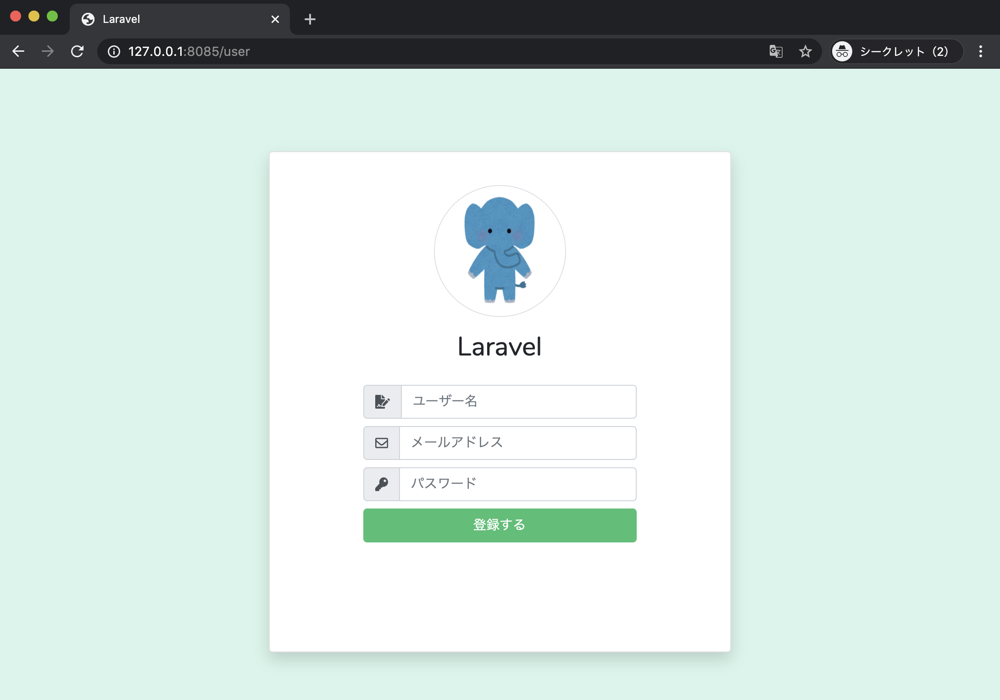
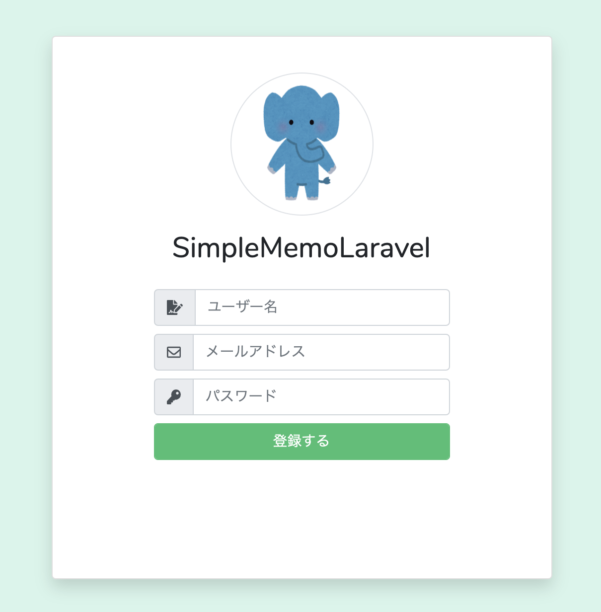

# 【Laravel】ユーザー登録画面を Blade で整える（`register.blade.php` とレイアウトの作成）


## 🎯 目標物

- `/user` にアクセスすると、**ユーザー登録画面**が表示される  
- 画面のヘッダーやスクリプト読込は **共通レイアウト**で管理  
- `.env` の `APP_NAME` を変更すると**画面上のアプリ名**が変わる

> 参考イメージ（省略）


---

## ✅ 手順一覧

1. `resources/views/auth/register.blade.php` を上書き
2. `resources/views/layouts/app.blade.php` を上書き（共通レイアウト）
3. ブラウザで表示確認
4. `.env` の `APP_NAME` を変更し、タイトル・画面表示が切り替わることを確認

---

## 1) `resources/views/auth/register.blade.php` を上書き

```php
@extends('layouts.app')

@section('content')
<div class="d-flex align-items-center justify-content-center h-100">
    <form method="get"  action="{{ route('memo.index') }}">
        <div class="card rounded login-card-width shadow">
            <div class="card-body">
                <div class="rounded-circle mx-auto border-gray border d-flex mt-3 icon-circle">
                    
                </div>
                <div class="d-flex justify-content-center">
                    <div class="mt-3 h2">{{ config('app.name') }}</div>
                </div>
                <div class="row mt-3">
                    <div class="offset-2 col-8 offset-2">
                        <label class="input-group w-100">
                                <span class="input-group-prepend">
                                    <span class="input-group-text"><i class="fas fa-file-signature"></i></span>
                                </span>
                            <input type="text" name="name" class="form-control" placeholder="ユーザー名" autocomplete="off" maxlength="255" />
                        </label>
                        <label class="input-group w-100">
                                <span class="input-group-prepend">
                                    <span class="input-group-text"><i class="far fa-envelope"></i></span>
                                </span>
                            <input type="text" name="email" class="form-control" placeholder="メールアドレス" autocomplete="off" maxlength="255" />
                        </label>
                        <label class="input-group w-100">
                                <span class="input-group-prepend">
                                    <span class="input-group-text"><i class="fas fa-key"></i></span>
                                </span>
                            <input type="password" name="password" class="form-control" placeholder="パスワード" autocomplete="off" maxlength="255" />
                        </label>
                        <button type="submit" class="form-control btn btn-success">
                            登録する
                        </button>
                    </div>
                </div>
            </div>
        </div>
    </form>
</div>
@endsection
```

補足（Blade のポイント）
- @extends('layouts.app')：共通レイアウトを継承
- @section('content') ... @endsection：レイアウトの @yield('content') に差し込まれる
- {{ route('memo.index') }}：routes/web.php の name('memo.index') に紐づく URL を生成
- {{ asset('...') }}：public を起点に静的ファイルの URL を生成
- {{ config('app.name') }}：config/app.php → .env の APP_NAME を参照

例：routes/web.php
```php
Route::get('/memo', function () {
    return view('memo');
})->name('memo.index');
```

---

## 2) resources/views/layouts/app.blade.php を上書き（共通レイアウト）
```php
<!doctype html>
<html lang="{{ str_replace('_', '-', app()->getLocale()) }}">
    <head>
        <meta charset="utf-8">
        <!-- CSRF Token -->
        <meta name="csrf-token" content="{{ csrf_token() }}">

        <title>{{ config('app.name', 'Laravel') }}</title>

        <!-- Scripts -->
        <script src="{{ asset('js/app.js') }}" defer></script>
        <script src="{{ asset('js/all.js') }}" defer></script>

        <!-- Fonts -->
        <link rel="dns-prefetch" href="//fonts.gstatic.com">
        <link href="https://fonts.googleapis.com/css?family=Nunito" rel="stylesheet">

        <!-- Styles -->
        <link href="{{ asset('css/app.css') }}" rel="stylesheet">
    </head>
    <body>
        @yield('content')
    </body>
</html>
```
補足（レイアウトのポイント）
- @yield('content') に各画面の @section('content') が入る
- <meta name="csrf-token"...> で CSRF 対策トークンを埋め込む（Laravel 標準）
- {{ asset('css/app.css') }} / {{ asset('js/app.js') }} は public/css, public/js のビルド済みを参照
（npm run dev / npm run build 等で出力）

---

## 3) ルーティングの追加
```php
Route::get('/', 'App\Http\Controllers\Auth\LoginController@showLoginForm')->name('login.index');
Route::get('/user', 'App\Http\Controllers\Auth\RegisterController@showRegistrationForm')->name('user.register');
Route::get('/memo', function() {
    return view("memo");
})->name('memo.index');

Auth::routes();
```

---

## 4) .env の APP_NAME を変更してアプリ名を差し替え

変更前
```.env
APP_NAME=Laravel
```
変更後
```.env
APP_NAME=SimpleMemoLaravel
```
config('app.name') → config/app.php の

'name' => env('APP_NAME', 'Laravel'),

を通じて .env の値を反映します。
ブラウザのタブタイトルや画面内の表示が SimpleMemoLaravel に変われば成功です。



変更が反映されない場合は、キャッシュをクリア：
```bash
php artisan config:clear
php artisan cache:clear
```

## 5) 動作確認

- ブラウザで http://127.0.0.1:8085/user にアクセス
- ユーザー登録画面が表示されれば OK


---

🔍 よくある質問（FAQ）
- 画像が表示されない
→ public/images/animal_stand_zou.png が存在するか、パスが合っているかを確認。
- スタイルが当たらない
→ public/css/app.css のビルド済みファイルがあるか、npm install && npm run dev を実行済みか確認。
- アプリ名が変わらない
→ .env の APP_NAME 修正後に php artisan config:clear を実行。

---

🧾 まとめ
- register.blade.php は layouts/app.blade.php を継承して画面を構成
- ルート名・アセット・アプリ名は route / asset / config ヘルパで安全に参照
- .env の APP_NAME を変えるだけで、画面上のアプリ名を簡単に切り替え可能

