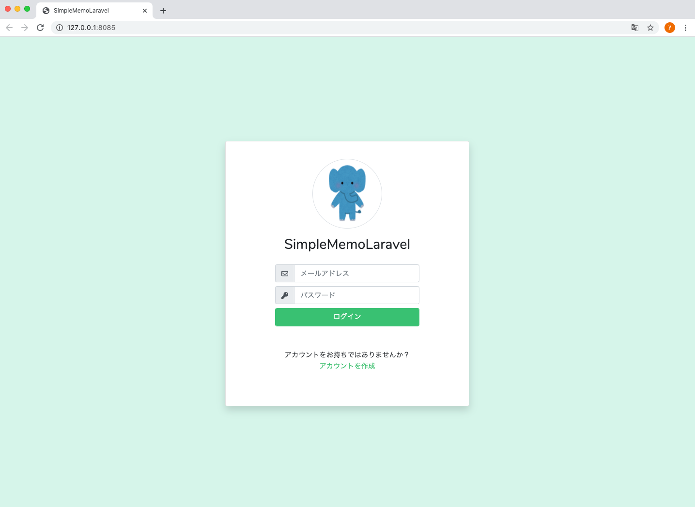

# 🔐 Laravelでログイン画面を作成しよう

このパートでは、**ログイン画面（`login.blade.php`）** を整えて、  
ユーザー登録画面（`register.blade.php`）とのリンク付きのデザインを完成させます。

---

## 🎯 本パートの目標物

以下のように、ロゴとフォーム付きの **ログイン画面** を表示します。

> 📸 *参考イメージ*

---

## 🧭 手順の流れ

1. `resources/views/auth/login.blade.php` を開く  
2. 指定コードで上書き保存  
3. ブラウザで表示確認  

---

## 📝 1) `resources/views/auth/login.blade.php` の内容

```php
@extends('layouts.app')

@section('content')
<div class="d-flex align-items-center justify-content-center h-100">
    <form method="get" action="{{ route('memo.index') }}">
        <div class="card rounded login-card-width shadow">
            <div class="card-body">
                <div class="rounded-circle mx-auto border-gray border d-flex mt-3 icon-circle">
                    
                </div>
                <div class="d-flex justify-content-center">
                    <div class="mt-3 h2">{{ config('app.name') }}</div>
                </div>
                <div class="row mt-3">
                    <div class="offset-2 col-8 offset-2">
                        <label class="input-group w-100">
                            <span class="input-group-prepend">
                                <span class="input-group-text"><i class="far fa-envelope"></i></span>
                            </span>
                            <input type="text" name="user_email" class="form-control" placeholder="メールアドレス" autocomplete="off" />
                        </label>
                        <label class="input-group w-100">
                            <span class="input-group-prepend">
                                <span class="input-group-text"><i class="fas fa-key"></i></span>
                            </span>
                            <input type="password" name="user_password" class="form-control" placeholder="パスワード" autocomplete="off" />
                        </label>
                        <button type="submit" class="form-control btn btn-success">
                            ログイン
                        </button>
                    </div>
                </div>
                <div class="mt-5">
                    <div class="d-flex justify-content-center">
                        アカウントをお持ちではありませんか？
                    </div>
                    <div class="d-flex justify-content-center">
                        <a href="{{ route('user.register') }}" class="text-success">アカウントを作成</a>
                    </div>
                </div>
            </div>
        </div>
    </form>
</div>
@endsection
```

---

### 💡 コードのポイント解説

🧩 Blade構文
	•	@extends('layouts.app')
→ 共通レイアウト（resources/views/layouts/app.blade.php）を継承します。
	•	@section('content') ... @endsection
→ レイアウト内の @yield('content') に差し込まれる内容です。

---

### 📤 routeヘルパー

フォーム送信先をルート名で指定しています。
```html
<form method="get" action="{{ route('memo.index') }}">
```
この memo.index は routes/web.php の以下の定義に対応しています：
```php
Route::get('/memo', function() {
    return view('memo');
})->name('memo.index');
```

---

### 🖼️ assetヘルパー

画像ファイルのURLを取得します。
```html

```
public/images/animal_stand_zou.png にある画像を呼び出します。

---

### ⚙️ configヘルパー

アプリ名を .env から取得して表示します。

{{ config('app.name') }}

config/app.php の以下の定義を通して .env の値を参照しています。

'name' => env('APP_NAME', 'Laravel'),


---

### 🔗 登録ページへのリンク

下記のリンクで、ユーザー登録画面に遷移します。
```html
<a href="{{ route('user.register') }}" class="text-success">アカウントを作成</a>
```
ルート設定（routes/web.php）は以下の通りです：
```php
Route::get('/user', 'App\Http\Controllers\Auth\RegisterController@showRegistrationForm')->name('user.register');
```
これにより、ユーザー登録画面が表示される仕組みです。

---

### 🌐 動作確認
1. ブラウザで以下のURLを開きます：
👉 http://127.0.0.1:8085/
2. 以下を確認できればOKです：
- ログイン画面が表示されている
- ロゴとアプリ名が表示されている
- 「アカウントを作成」リンクをクリックすると登録画面に遷移する

📸 表示例

---

# 🎉 まとめ

項目	内容
Blade構文	@extends, @section, @yield を活用
routeヘルパー	名前付きルートを指定してURLを生成
assetヘルパー	画像・CSS・JSなどの静的ファイルパスを取得
configヘルパー	.env の設定値（APP_NAMEなど）を取得
登録画面リンク	route('user.register') でスムーズに遷移

