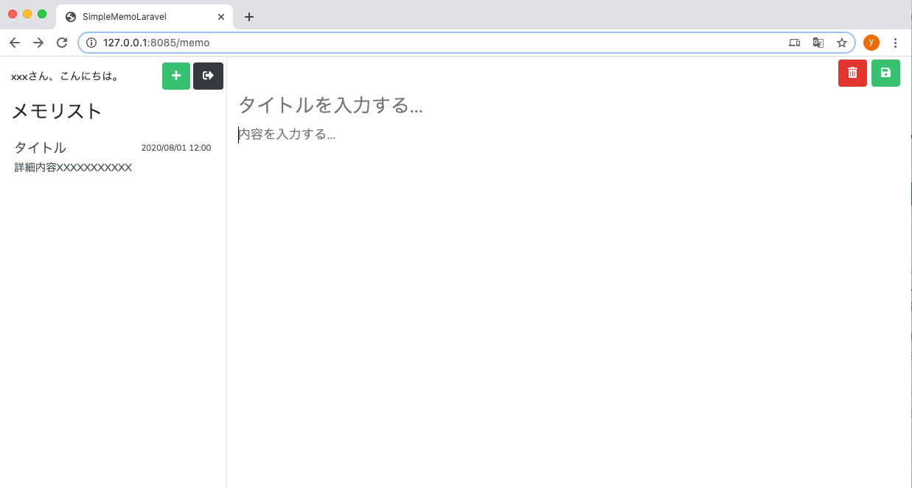

# 📝 Laravelでメモ投稿画面を作成しよう

## 🎯 本パートの目標物

以下のようなメモ投稿画面を表示します。

> 📸 *参考イメージ（省略）*  
> 左側にメモ一覧、右側に選択中メモの編集エリアがある2カラム構成です。

---

## 🧭 作成手順

1. `resources/views/memo.blade.php` を開く  
2. 指定されたコードで上書き保存  
3. ブラウザで動作確認  

---

### 📝 1) `resources/views/memo.blade.php` の内容

```blade
{{-- resources/views/memo.blade.php --}}
@extends('layouts.app')

@section('content')
<div class="h-100 bg-white">
    <div class="row h-100 m-0 p-0">
        <!-- 左側：メモ一覧エリア -->
        <div class="col-3 h-100 m-0 p-0 border-left border-right border-gray">
            <div class="left-memo-menu d-flex justify-content-between pt-2">
                <div class="pl-3 pt-2">
                    xxxさん、こんにちは。
                </div>
                <div class="pr-1">
                    <a href="" class="btn btn-success"><i class="fas fa-plus"></i></a>
                    <a href="{{ route('login.index') }}" class="btn btn-dark"><i class="fas fa-sign-out-alt"></i></a>
                </div>
            </div>
            <div class="left-memo-title h3 pl-3 pt-3">
                メモリスト
            </div>
            <div class="left-memo-list list-group-flush p-0">
                <a href="" class="list-group-item list-group-item-action">
                    <div class="d-flex w-100 justify-content-between">
                        <h5 class="mb-1">タイトル</h5>
                        <small>2020/08/01 12:00</small>
                    </div>
                    <p class="mb-1">
                        詳細内容XXXXXXXXXXX
                    </p>
                </a>
            </div>
        </div>

        <!-- 右側：メモ編集エリア -->
        <div class="col-9 h-100">
            <form class="w-100 h-100" method="post">
                <input type="hidden" name="edit_id" value="" />
                <div id="memo-menu">
                    <button type="button" class="btn btn-danger" formaction=""><i class="fas fa-trash-alt"></i></button>
                    <button type="button" class="btn btn-success" formaction=""><i class="fas fa-save"></i></button>
                </div>
                <input type="text" id="memo-title" name="edit_title" placeholder="タイトルを入力する..." value="" />
                <textarea id="memo-content" name="edit_content" placeholder="内容を入力する..."></textarea>
            </form>
        </div>
    </div>
</div>
@endsection
```

---

### 💡 コードのポイント

🧩 Blade構文

@extends('layouts.app') と @section('content') はこれまでと同様、
共通レイアウト（layouts/app.blade.php）を継承して画面を構成します。

---

### 🔗 routeヘルパーでの画面遷移

<a href="{{ route('login.index') }}" class="btn btn-dark"><i class="fas fa-sign-out-alt"></i></a>

この部分では、ログアウトボタンが押された際に
ログイン画面（login.index）へ遷移するよう設定されています。

対応するルートは routes/web.php に以下のように定義します。

Route::get('/login', 'App\Http\Controllers\Auth\LoginController@showLoginForm')->name('login.index');


---

### 🧱 画面構成の概要

エリア	内容
左カラム	メモリストとログイン中ユーザーの挨拶、追加・ログアウトボタン
右カラム	選択したメモのタイトル・内容編集フォーム
ボタン	「＋」新規作成、「💾」保存、「🗑️」削除


---

### 🌐 動作確認

ブラウザで次のURLにアクセスしてください。

👉 http://127.0.0.1:8085/memo

表示確認ポイント：
- メモ一覧（左側）と編集エリア（右側）が表示されている
- 画面上部に「xxxさん、こんにちは。」の表示がある
- 「＋」ボタンと「ログアウト」ボタンが並んでいる

> 📸 確認イメージ（省略）


---

# 🧾 まとめ

| 項目 | 内容 |
|---------------|-------------|
|ファイル|resources/views/memo.blade.php|
|構成|左カラム：メモ一覧、右カラム：編集フォーム|
|遷移|route('login.index') でログイン画面へ戻る|
|今後の拡張|ログインユーザー名の表示、メモデータの動的表示、保存処理の実装など|

