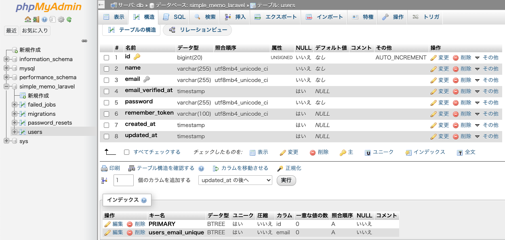
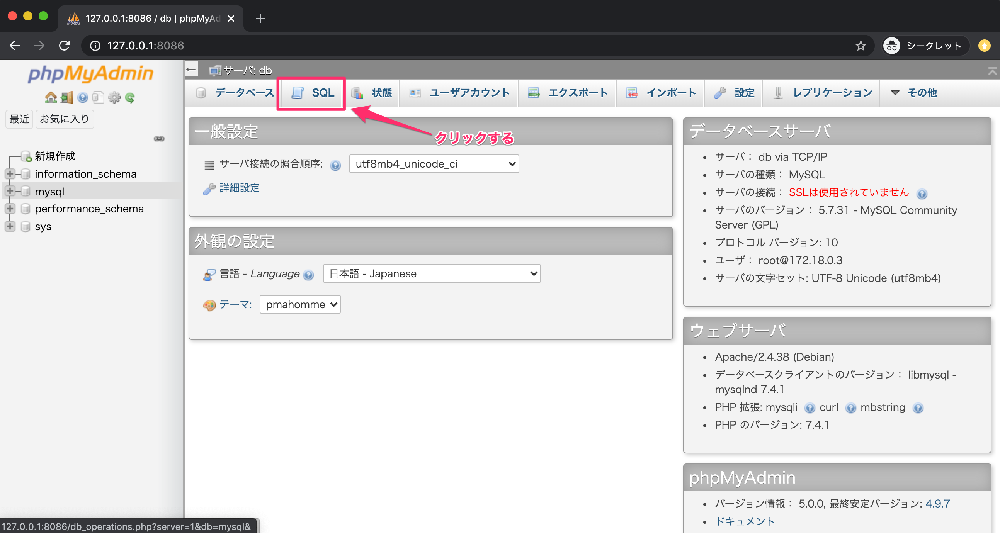
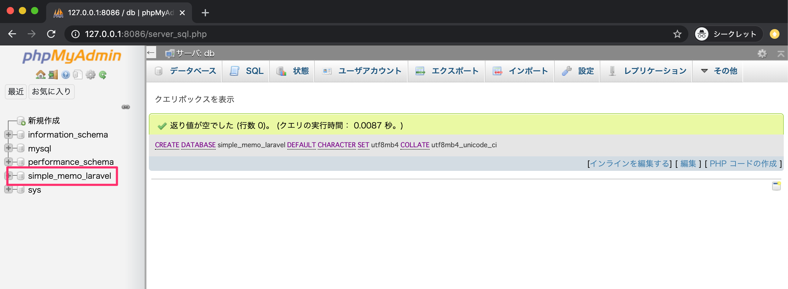

# 📦 Laravel × MySQL：ユーザーテーブルをマイグレーションで作成する

## 🎯 目標
- simple_memo_laravel データベースを作成
- .env を正しく設定して MySQL に接続
- php artisan migrate で users を含む標準テーブルを作成
- 必要に応じてロールバックの確認
- マイグレーションファイル（create_users_table）の構造を理解

完成イメージ（phpMyAdmin）：

simple_memo_laravel に users, password_resets, failed_jobs, migrations が作成される（本教材では users を使用）



---

## 🧭 手順の流れ
1. phpMyAdmin でデータベース作成
2. .env を MySQL 接続情報に合わせて修正
3. Docker コンテナに入り、プロジェクト直下へ移動
4. マイグレーション実行（テーブル作成）
5. phpMyAdmin で作成されたテーブルを確認
6. （任意）ロールバックの挙動確認
7. マイグレーションファイルの中身を理解

---

### 1) データベースを作成する

Docker を起動後、http://127.0.0.1:8086 を開き、SQL タブで以下を実行：



```sql
CREATE DATABASE simple_memo_laravel
  DEFAULT CHARACTER SET utf8mb4
  COLLATE utf8mb4_unicode_ci;
```
📌 作成後、左ペインに simple_memo_laravel が表示されれば OK。



---

### 2) .env を MySQL 接続に合わせて修正

プロジェクト直下の .env を開いて次のように編集します。

変更前（例）

```.env
DB_CONNECTION=mysql
DB_HOST=127.0.0.1
DB_PORT=3306
DB_DATABASE=laravel
DB_USERNAME=root
DB_PASSWORD=
```

変更後

```.env
DB_CONNECTION=mysql
DB_HOST=db
DB_PORT=3306
DB_DATABASE=simple_memo_laravel
DB_USERNAME=root
DB_PASSWORD=password
```

📝 DB_HOST=db は docker-compose で定義した MySQL サービス名 に合わせます。教材の環境では db を使用。

---

### 3) Docker コンテナへ入る & プロジェクトに移動

```bash
docker-compose exec php bash
cd memo-laravel
```

---

### 4) マイグレーションを実行

```bash
php artisan migrate
```
成功例
```
Migration table created successfully.
Migrating: 2014_10_12_000000_create_users_table
Migrated : 2014_10_12_000000_create_users_table
Migrating: 2014_10_12_100000_create_password_resets_table
Migrated : 2014_10_12_100000_create_password_resets_table
Migrating: 2019_08_19_000000_create_failed_jobs_table
Migrated : 2019_08_19_000000_create_failed_jobs_table
```
2回目以降は Nothing to migrate. と表示されます。

---

5) phpMyAdmin でテーブルを確認

http://127.0.0.1:8086 → simple_memo_laravel を選択し、
users, password_resets, failed_jobs, migrations が作成されているか確認します。
- 今回使うのは users テーブル
- migrations はマイグレーションの実行履歴を管理するメタテーブル

---

（寄り道）6) ロールバックを試す

直近のマイグレーションを元に戻す：
```bash
php artisan migrate:rollback
```
実行例：
```
Rolling back: 2019_08_19_000000_create_failed_jobs_table
Rolled back : 2019_08_19_000000_create_failed_jobs_table
Rolling back: 2014_10_12_100000_create_password_resets_table
Rolled back : 2014_10_12_100000_create_password_resets_table
Rolling back: 2014_10_12_000000_create_users_table
Rolled back : 2014_10_12_000000_create_users_table
```
再度作成したい場合は：

```bash
php artisan migrate
```

💡 migrations テーブルの batch カラムで「どのまとまり」で適用されたかが管理され、最新の batch から順に戻すのが rollback の挙動です。

---

### 7) マイグレーションファイルを読み解く

対象：database/migrations/2014_10_12_000000_create_users_table.php
```php
class CreateUsersTable extends Migration
{
    /** 実行（作成・変更） */
    public function up()
    {
        Schema::create('users', function (Blueprint $table) {
            $table->id();                          // BIGINT AUTO_INCREMENT 主キー(id)
            $table->string('name');                // VARCHAR(255)
            $table->string('email')->unique();     // VARCHAR(255) + UNIQUE 制約
            $table->timestamp('email_verified_at')->nullable(); // 認証日時(NULL可)
            $table->string('password');            // パスワード
            $table->rememberToken();               // remember_token (ログイン保持用)
            $table->timestamps();                  // created_at / updated_at (NULL可)
        });
    }

    /** 取り消し（ロールバック時） */
    public function down()
    {
        Schema::dropIfExists('users');            // users テーブルがあれば削除
    }
}
```

✅ ポイント解説
- $table->id()
id BIGINT UNSIGNED AUTO_INCREMENT PRIMARY KEY を自動定義
- $table->string('name', 100) のようにカラム長も指定可能（省略時 255）
- $table->string('email')->unique()
ユニーク制約で重複登録を禁止
- $table->timestamp('email_verified_at')->nullable()
NULL許可でメール認証日を持てるように
- $table->rememberToken()
remember me 機能用のトークン
- $table->timestamps()
created_at / updated_at を自動で用意

phpMyAdmin で users の構造を見ると、上記が反映されていることが分かります。

---

🔧 つまずきポイント（簡易チェック）
- 接続できない / migrate で失敗する
→ .env の DB_HOST, DB_DATABASE, DB_USERNAME, DB_PASSWORD が正しいか。Docker の MySQL サービス名は db になっているか。
- マイグレーションが反映されない
→ 対象 DB が simple_memo_laravel になっているか、php artisan migrate をプロジェクト直下で実行しているか。
- 再実行したい
→ php artisan migrate:rollback で戻してから再度 php artisan migrate。

---

✅ まとめ
- DB を SQL で作成 → .env を 接続設定 → php artisan migrate で テーブル作成
- migrations テーブルが 履歴 を持ち、rollback で簡単に元に戻せる
- マイグレーションファイルの up が適用、down が取り消しの役割

これで、Laravel 標準のユーザーテーブルがデータベースに作成できました。
次は、このテーブルを使って認証や画面と連携していきましょう！