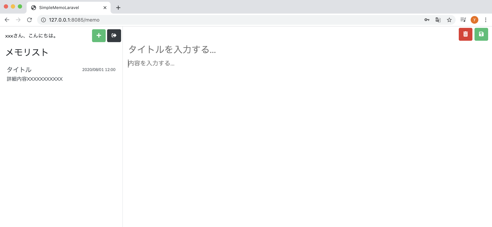
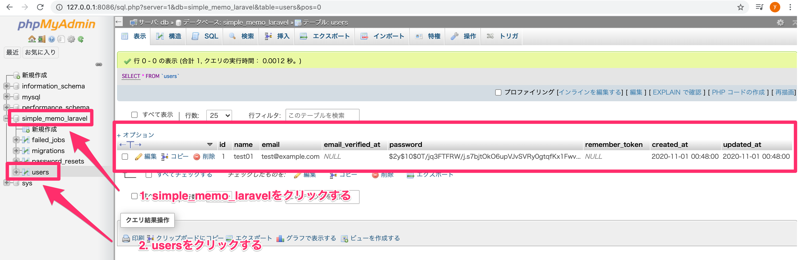

# ユーザー登録機能を実装

## 🎯 目標
- 登録フォームから送信 → users テーブルへ INSERT
- 登録後に メモ投稿画面へリダイレクト
- phpMyAdmin で登録レコードを確認

---

全体の流れ
1. RegisterController に登録処理メソッドを実装（標準メソッドは使わず上書き）
2. routes/web.php に登録用ルートを追加
3. resources/views/auth/register.blade.php をPOST 送信に修正（CSRF 対応）
4. 動作確認（フォーム送信 → DB 保存 → 画面遷移）

---

### 1) ユーザー登録処理を作成する

今回、FormRequest でのバリデーションを前提にしたいため、Laravel 標準の validator / create は使わずに上書きします。

#### 不要メソッドを削除
*app/Http/Controllers/Auth/RegisterController.php*
```php

// ... 省略 ...
use RegistersUsers;

protected $redirectTo = RouteServiceProvider::HOME;

public function __construct()
{
    $this->middleware('guest');
}

// --------- ここから削除 ---------
protected function validator(array $data) { /* ... */ }
protected function create(array $data) { /* ... */ }
// --------- ここまで削除 ---------
```

#### use 文の追加
```php
use App\Providers\RouteServiceProvider;
use App\Models\User;
use Illuminate\Foundation\Auth\RegistersUsers;
// ------ ここから追加 ------
use Illuminate\Http\RedirectResponse;
use Illuminate\Http\Request;
// ------ ここまで追加 ------
use Illuminate\Support\Facades\Hash;
use Illuminate\Support\Facades\Validator;
```

#### 登録メソッドを追加
```php
/**
 * ユーザー登録後、投稿画面に遷移する
 * @param Request $request
 * @return RedirectResponse
 */
public function register(Request $request)
{
    User::create([
        'name'     => $request->name,
        'email'    => $request->email,
        'password' => Hash::make($request->password),
    ]);

    return redirect()->route('memo.index');
}
```

ポイント
- Request でフォーム入力値（name / email / password）を受け取る
- User::create() で登録（password は Hash::make() でハッシュ化）
- 登録後は memo.index へリダイレクト

> 🔎 create を使うには、app/Models/User.php の $fillable に name, email, password が定義されている必要があります（Laravel 既定で定義済み）。

---

### 2) ルーティングを追加

*routes/web.php*

```php
Route::get('/user', 'App\Http\Controllers\Auth\RegisterController@showRegistrationForm')
    ->name('user.register');

// --- ここから追加 ---
Route::post('/user/register', 'App\Http\Controllers\Auth\RegisterController@register')
    ->name('user.exec.register');
// --- ここまで追加 ---

Route::get('/memo', function () {
    return view('memo');
})->name('memo.index');
```

- POST /user/register で今回の register() を呼び出し
- ビュー側では route('user.exec.register') を利用

---

### 3) ユーザー登録画面を修正（POST & CSRF）

*resources/views/auth/register.blade.php*

変更前（抜粋）

```php
<form method="get" action="{{ route('memo.index') }}">
```

変更後

```php
<form method="post" action="{{ route('user.exec.register') }}">
    @csrf
    <!-- フィールド群 ... -->
</form>
```

ポイント
- method="post" に変更
- @csrf を必ず挿入（Laravel の CSRF 対策・未挿入だと 419 エラー）

フォームの各 name は以下の通り（Request で受け取るキーと一致）：
```php
<input type="text"     name="name"     ... />
<input type="text"     name="email"    ... />
<input type="password" name="password" ... />
```

---

### 4) 動作確認
1. http://localhost:8085/user へアクセス
2. ユーザー名 / メールアドレス / パスワード を入力 → 登録
3. メモ投稿画面へ遷移することを確認

4. http://localhost:8086（phpMyAdmin）→ simple_memo_laravel → users を開き、レコードが作成されていることを確認


---

## 補足：モデル/テーブル命名のルール
- モデル：アッパーキャメル・単数形（例：User）
- テーブル：スネークケース・複数形（例：users）

テーブル名を変えたい場合は、モデルで $table = 'my_table'; を指定。


## まとめ
- RegisterController@register を用意して 登録 → リダイレクト を実装
- routes/web.php に POST ルート を追加
- 登録フォームは POST + @csrf に修正
- 送信値 → User::create()（$fillable 必須）で DB 登録
- phpMyAdmin で users にデータが入っていることを確認