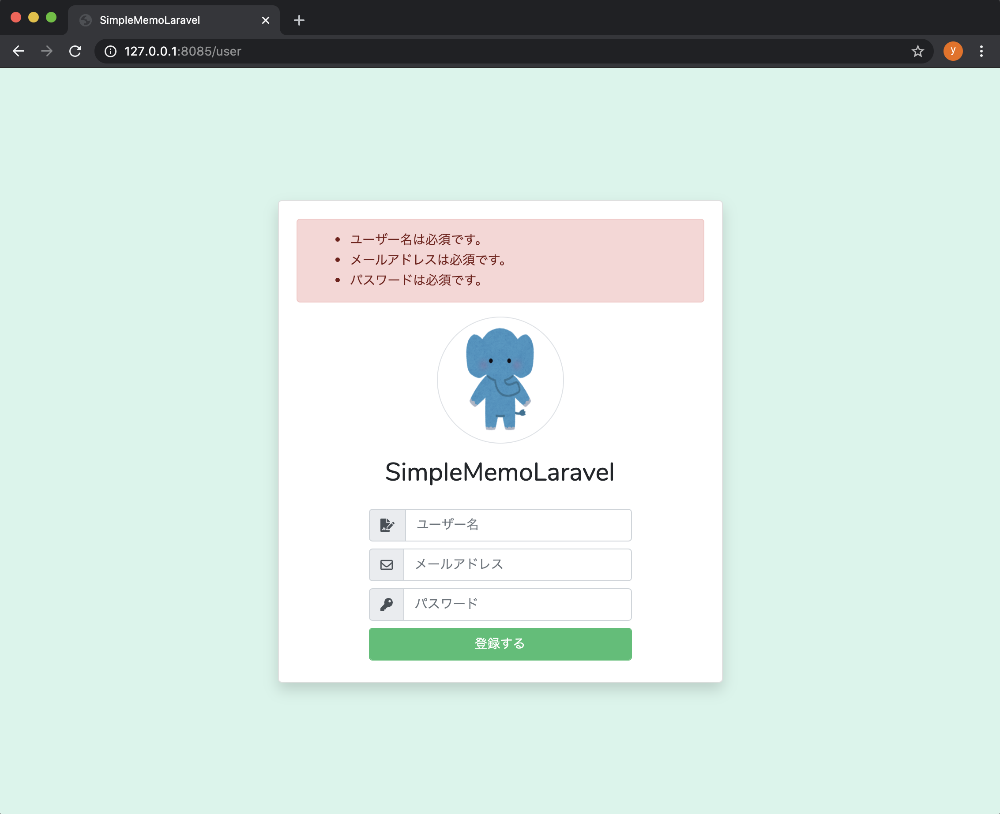

# ユーザー登録画面にバリデーションを実装する（FormRequestまで）

このパートでは、**ユーザー登録フォームにバリデーションを実装**し、
不正な値が入力されたときに、次のようなエラーメッセージが表示されるようにします。

> ❌ 名前・メールアドレス・パスワードが未入力／形式不正／重複している など



---

## 🎯 本パートの目標

* 不正な値で「登録する」をクリックしたときに、**エラーメッセージが表示される**
* エラーメッセージを **日本語化** する
* 最終的に、**FormRequest を使ったバリデーション構成**にする

---

## 全体の流れ

1. **Request クラス**のインスタンスを使って、Controller 内にバリデーションを書く
2. **バリデーションメッセージを日本語化**する（`resources/lang` に ja ディレクトリ作成）
3. **言語設定を日本語に切り替え**る（`config/app.php` を編集）
4. **FormRequest クラス**を作成し、バリデーションロジックをそちらへ移動する

適宜、ブラウザで動作確認を行いながら進めます。

> PHP バージョンのときと違って、Laravel にはバリデーション機能が標準で用意されています。
> 共通関数は不要で、**Laravel の機能だけで実現**できます。

---

## 1. Request インスタンスを使ってバリデーションする

まずは、**コントローラーの中にバリデーションを書く方法**から始めます。
後でこれを FormRequest に移動するので、「一旦 Controller に直書きする」イメージです。

### RegisterController にバリデーションを追加

`app/Http/Controllers/Auth/RegisterController.php` を開き、
`register` メソッドの先頭にバリデーションを追記します。

```php
public function register(Request $request)
{
    // ---- ここから追加 ----
    $request->validate([
        'name'     => 'required|max:255|regex:/^[a-zA-Z0-9]+$/',
        'email'    => 'required|max:255|email|unique:users',
        'password' => 'required|max:255|min:8|regex:/^[a-zA-Z0-9]+$/',
    ]);
    // ---- ここまで追加 ----

    User::create([
        'name'     => $request->name,
        'email'    => $request->email,
        'password' => Hash::make($request->password),
    ]);

    return redirect()->route('memo.index');
}
```

### バリデーションルールの意味

`$request->validate([...])` の配列は、

* **左側**：フォームの `name` 属性（キー）
* **右側**：適用するルール（`|` でつなげて複数指定）

ルールの種類は以下の通りです：

| ルール            | 内容                                  |
| -------------- | ----------------------------------- |
| `required`     | 必須。値が空ならエラー                         |
| `max:255`      | 最大文字数チェック。255文字を超えたらエラー             |
| `min:8`        | 最小文字数チェック。8文字未満ならエラー                |
| `regex:/.../`  | 正規表現チェック。パターンに合わなければエラー             |
| `email`        | メールアドレス形式かどうか                       |
| `unique:users` | `users` テーブルに同じ値が既に存在していたらエラー（重複禁止） |

#### 各フィールドの設定

* `name`

  ```php
  'name' => 'required|max:255|regex:/^[a-zA-Z0-9]+$/',
  ```

  * 必須・255文字以内・**半角英数字のみ**

* `email`

  ```php
  'email' => 'required|max:255|email|unique:users',
  ```

  * 必須・255文字以内・メールアドレス形式・`users.email` が重複していたらエラー

* `password`

  ```php
  'password' => 'required|max:255|min:8|regex:/^[a-zA-Z0-9]+$/',
  ```

  * 必須・255文字以内・8文字以上・**半角英数字のみ**

> `$request->validate()` が実行された時点でバリデーションが行われ、
> エラーがある場合は **元の画面にリダイレクトし、エラーメッセージをセッションに格納**して処理を止めます。

---

## 2. エラーメッセージを画面に表示する（Blade 側）

つづいて、**エラーメッセージを表示するエリア**を Blade に追加します。

`resources/views/auth/register.blade.php` を開き、
カードの中の先頭あたりに、次を追記します。

```blade
@extends('layouts.app')

@section('content')
<div class="d-flex align-items-center justify-content-center h-100">
    <form method="post" action="{{ route('user.exec.register') }}">
        @csrf
        <div class="card rounded login-card-width shadow">
            <div class="card-body">

                {{-- ▼ここから追加 --}}
                @if ($errors->any())
                    <div class="alert alert-danger">
                        <ul class="mb-0 mt-0">
                            @foreach ($errors->all() as $error)
                                <li>{{ $error }}</li>
                            @endforeach
                        </ul>
                    </div>
                @endif
                {{-- ▲ここまで追加 --}}

                <div class="rounded-circle mx-auto border-gray border d-flex mt-3 icon-circle">
                    
                </div>
                {{-- ... 以下フォーム本体 --}}
```

### ここでのポイント

* Laravel でバリデーションに失敗すると、**`$errors` 変数にエラー情報が自動で詰められる**
* `$errors->any()`：エラーが一件でもあれば `true`
* `$errors->all()`：すべてのエラーメッセージ（文字列配列）

---

## 3. 英語のメッセージを日本語化する

現状のメッセージは英語のままなので、**日本語メッセージに差し替え**ます。

### 3-1. 言語ファイルディレクトリ `ja` を作る

1. `resources/lang/en` ディレクトリを **コピー**
2. `resources/lang/ja` として **ペースト**

構造イメージ：

```text
resources/
  lang/
    en/
      validation.php
      ...
    ja/
      validation.php  ← 新しく作成された
      ...
```

### 3-2. `validation.php` のメッセージを書き換え

`resources/lang/ja/validation.php` を開き、
使うルールだけ日本語化していきます。

#### required

```php
'required' => ':attributeは必須です。',
```

#### max（`string` のみ）

```php
'max' => [
    'numeric' => 'The :attribute may not be greater than :max.',
    'file'    => 'The :attribute may not be greater than :max kilobytes.',
    'string'  => ':attributeは:max文字以内で入力してください。',
    'array'   => 'The :attribute may not have more than :max items.',
],
```

#### min（`string` のみ）

```php
'min' => [
    'numeric' => 'The :attribute must be at least :min.',
    'file'    => 'The :attribute must be at least :min kilobytes.',
    'string'  => ':attributeは:min文字以上で入力してください。',
    'array'   => 'The :attribute must have at least :min items.',
],
```

#### email

```php
'email' => '正しいメールアドレスを入力してください。',
```

#### unique

```php
'unique' => '既に登録されている:attributeです。',
```

#### attributes セクション

最後に、項目名を日本語に対応させます。

```php
'attributes' => [
    'name'     => 'ユーザー名',
    'email'    => 'メールアドレス',
    'password' => 'パスワード',
],
```

これで、

```text
:attributeは必須です。
```

→ `ユーザー名は必須です。`
のように置き換わるようになります。

> ※ `regex` のエラーメッセージは「フォーマットが無効です」のような汎用文なので、
> 個別にメッセージを指定してあげます（後述）。

---

## 4. 使用言語を日本語に切り替える

現在は `en` 設定のままなので、**言語コードを `ja` に変更**します。

`config/app.php` を開きます。

```php
'locale' => 'en',
```

これを次のように変更：

```php
'locale' => 'ja',
```

これで、Laravel は `resources/lang/ja` 以下のファイルを参照するようになります。

---

## 5. 正規表現（regex）のエラーメッセージを個別定義

「フォーマットが無効です」だと少し不親切なので、
**ユーザー名・パスワードの regex 用メッセージ**を別途定義します。

`app/Http/Controllers/Auth/RegisterController.php` の `validate` を次のように修正：

```php
$request->validate(
    [
        'name'     => 'required|max:255|regex:/^[a-zA-Z0-9]+$/',
        'email'    => 'required|max:255|email|unique:users',
        'password' => 'required|max:255|min:8|regex:/^[a-zA-Z0-9]+$/',
    ],
    // ▼ 第2引数：カスタムメッセージ
    [
        'name.regex'     => ':attributeは半角英数字で入力してください。',
        'password.regex' => ':attributeは半角英数字で入力してください。',
    ]
);
```

* `name.regex`
  → `name` フィールドの `regex` ルールで失敗したときのメッセージ
* `password.regex`
  → `password` フィールドの `regex` ルールで失敗したときのメッセージ

---

## 6. バリデーションの動作確認（Request 版）

`http://localhost:8085/user` にアクセスして確認します。

### ✅ 必須チェック

* 何も入力せず「登録」をクリック
  → すべての項目で **「〜は必須です。」** が表示

### ✅ 最小文字数チェック（パスワード）

* 名前：適当な半角英数字
* メール：正しい形式
* パスワード：7文字（例：`abc1234`）
  → **「パスワードは8文字以上で入力してください。」** が表示

### ✅ メールアドレス形式チェック

* メールアドレス：`taro` や `taro@` のように不正な形式
  → **「正しいメールアドレスを入力してください。」** が表示

### ✅ 半角英数字チェック（regex）

* 名前・パスワードを全角文字にする（例：`テストユーザ`）
  → **「ユーザー名は半角英数字で入力してください。」** などが表示

### ✅ メールアドレス重複チェック

1. まず、

   * ユーザー名：`taro`
   * メール：`taro@example.com`
   * パスワード：`taro12345`
     で登録（DB にユーザーが1件できる）
2. 再度同じ情報で登録
   → **「既に登録されているメールアドレスです。」** が表示


---

## 7. FormRequest（フォームリクエスト）でバリデーションを分離する

ここまでで Request 版のバリデーションは完成しましたが、
Controller が少しごちゃっとしてくるので、**専用クラス（FormRequest）に抽出**します。

### 7-1. artisan コマンドで FormRequest を作成

Docker コンテナ内で、Laravel プロジェクト配下へ移動した上で：

```bash
php artisan make:request UserCreateRequest
```

成功すると：

```bash
Request created successfully.
```

### 7-2. UserCreateRequest を修正

`app/Http/Requests/UserCreateRequest.php` を開きます。

#### authorize メソッドを true に変更

```php
public function authorize()
{
    // デフォルトは false なので
    return true;
}
```

> false のままだと **常に 403 Forbidden** になり、Controller に到達しません。

#### rules メソッドにルールを定義

```php
public function rules()
{
    return [
        'name'     => 'required|max:255|regex:/^[a-zA-Z0-9]+$/',
        'email'    => 'required|max:255|email|unique:users',
        'password' => 'required|max:255|min:8|regex:/^[a-zA-Z0-9]+$/',
    ];
}
```

#### messages メソッドを追加（カスタムメッセージ）

```php
public function messages()
{
    return [
        'name.regex'     => ':attributeは半角英数字で入力してください。',
        'password.regex' => ':attributeは半角英数字で入力してください。',
    ];
}
```

> ここで書いている内容は、先ほど `validate()` の第2引数で書いていた配列と同じです。

### 7-3. RegisterController で FormRequest を使う

`app/Http/Controllers/Auth/RegisterController.php` を修正します。

#### use 文に追加

```php
use App\Http\Controllers\Controller;
// ▼追加
use App\Http\Requests\UserCreateRequest;
use App\Providers\RouteServiceProvider;
```

#### メソッドシグネチャを書き換え

```php
/**
 * ユーザー登録後、投稿画面に遷移する
 * @param UserCreateRequest $request
 * @return RedirectResponse
 */
public function register(UserCreateRequest $request)
{
    User::create([
        'name'     => $request->name,
        'email'    => $request->email,
        'password' => Hash::make($request->password),
    ]);

    return redirect()->route('memo.index');
}
```

#### `$request->validate(...)` は削除

```php
public function register(UserCreateRequest $request)
{
    // このブロックは削除してOK
    // $request->validate([...], [...]);

    User::create([
        'name'     => $request->name,
        'email'    => $request->email,
        'password' => Hash::make($request->password),
    ]);

    return redirect()->route('memo.index');
}
```

### FormRequest 版のポイント

* Controller の `register()` に到達する前に、
  **UserCreateRequest の `rules()` & `messages()` でバリデーション**が実行される
* バリデーションエラー時の挙動は、`$request->validate()` と同じ（元の画面へリダイレクト＆ `$errors` セット）
* Controller 側のコードが **非常にスッキリする**

---

## 8. FormRequest 版の動作確認

挙動自体は `$request->validate()` の時と同じです。

`http://localhost:8085/user` にアクセスして：

* 必須チェック
* 文字数（min / max）
* 正規表現（半角英数字）
* メール形式
* 重複チェック

を、それぞれ確認します。


---

## まとめ

* Laravel のバリデーションは **Request から簡単に実行**できる
* エラーメッセージは `resources/lang/ja/validation.php` で **日本語化＆項目名置換**が可能
* `config/app.php` の `locale` を `ja` にすれば日本語メッセージを利用できる
* 正規表現など、ルールごとのメッセージは **`フィールド.ルール` 形式で個別定義**できる
* 最終的には **FormRequest（`UserCreateRequest`）** にバリデーションロジックを移動し、
  Controller は「登録処理とリダイレクトのみ」というシンプルな形に整理できる

この構成にしておくと、今後ルールやメッセージが増えても、
**「バリデーションは FormRequest に集約」**という分かりやすい設計で管理できます。
