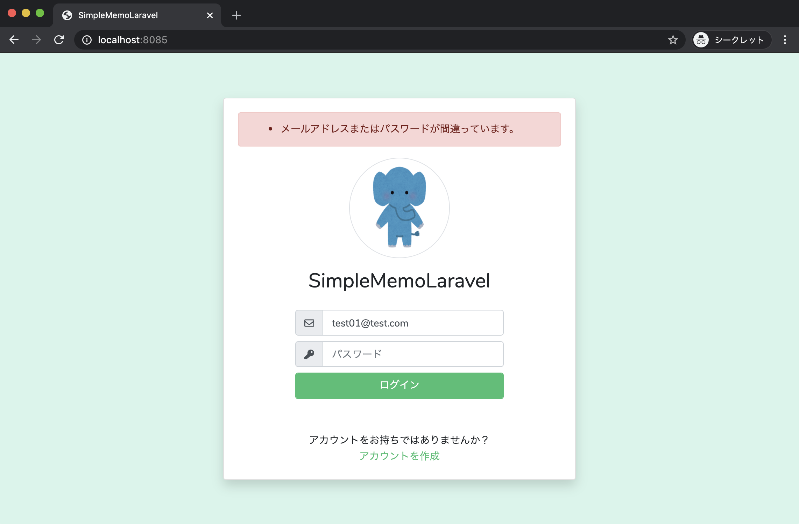
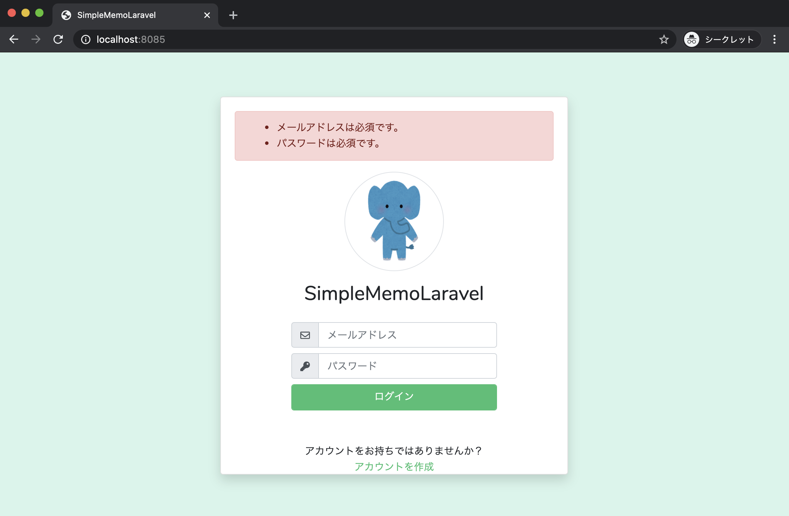
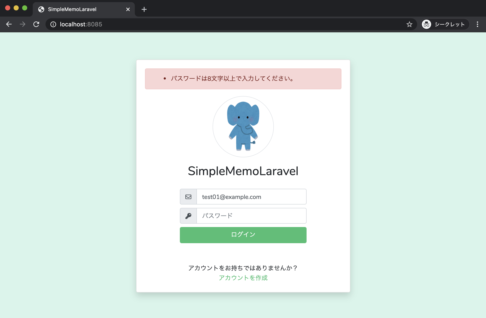
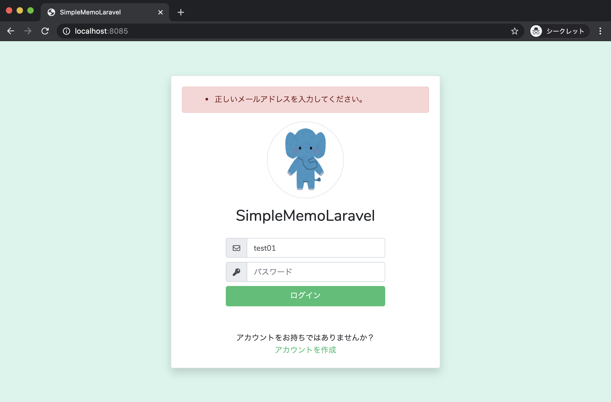
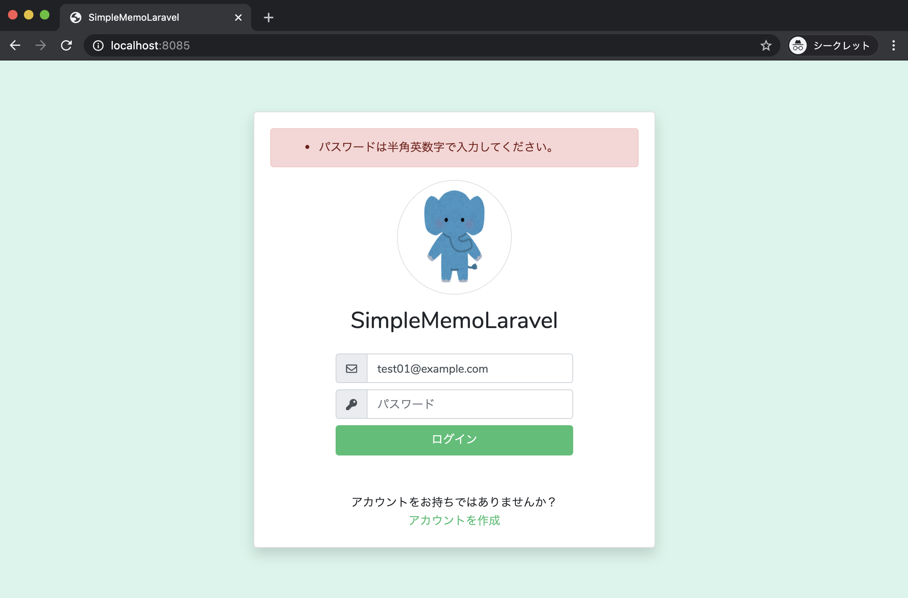
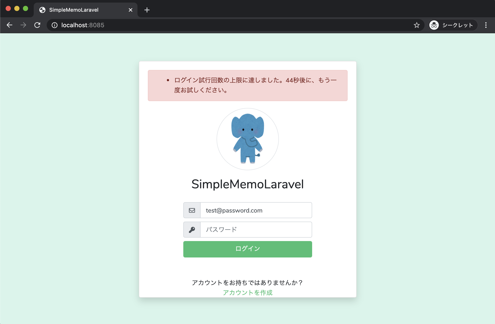
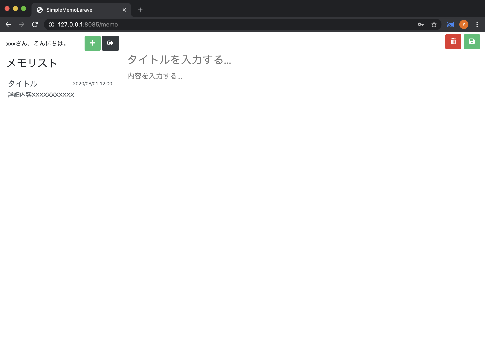

# 5-? ログイン機能にバリデーションとエラーメッセージ表示を実装しよう

このパートでは、**Laravel 標準の認証機能を活かしつつ、ログイン時のバリデーションとエラーメッセージ表示を実装**します。

---

## 🎯 本パートの目標

* 正常にログインできたら、**メモ投稿画面（`/memo`）に遷移**する
* 入力内容に誤りがあれば、**ログイン画面上部にエラーメッセージを表示**する



---

## 全体の流れ

1. **ログインコントローラー**（`app/Http/Controllers/Auth/LoginController.php`）を修正する
2. **ログイン画面**（`resources/views/auth/login.blade.php`）を修正する
3. **言語ファイル**（`resources/lang/ja/auth.php`）を修正する
4. ブラウザから **動作確認を行う**

Laravel 標準のログイン機能がすでに用意されているので、**少ない変更で実現**できます。

---

## 1. ログインコントローラーを修正する

まずは、ログイン処理を担当するコントローラーから修正します。

### 1-1. `use` 文を追加する

`app/Http/Controllers/Auth/LoginController.php` を開き、`use` 文に `Request` を追加します。

```php
use App\Providers\RouteServiceProvider;
use Illuminate\Foundation\Auth\AuthenticatesUsers;
// ------ ここから追加する -------
use Illuminate\Http\Request;
// ------ ここまで追加する -------
```

これにより、メソッドの引数で `Request` クラスをフルパス指定せずに使えるようになります。

---

### 1-2. ログイン後の遷移先を `/memo` に変更

`$redirectTo` の値を修正します。

```php
// 修正前
protected $redirectTo = RouteServiceProvider::HOME;

// 修正後
protected $redirectTo = '/memo';
```

```php
// ------ 省略 ------
protected $redirectTo = '/memo';
// ------ 省略 ------
```

ログイン成功時に、**メモ投稿画面 (`/memo`) へリダイレクトされる**ようになります。

---

### 1-3. `validateLogin` メソッドを追加する

続けて、ログイン時のバリデーションを行う `validateLogin` メソッドを追加します。

```php
protected $redirectTo = '/memo';

// ------- ここから追加する ------
/**
 * ログイン時のバリデーション
 * @param Request $request
 */
protected function validateLogin(Request $request)
{
    $request->validate(
        [
            $this->username() => 'required|max:255|email',
            'password'        => 'required|min:8|max:255|regex:/^[a-zA-Z0-9]+$/',
        ],
        [
            'password.regex' => ':attributeは半角英数字で入力してください。'
        ]
    );
}
// ------- ここまで追加する ------

/**
 * Create a new controller instance.
 *
 * @return void
 */
public function __construct()
{
    $this->middleware('guest')->except('logout');
}
```

#### このメソッドのポイント

* `$this->username()`
  → デフォルトでは `email` が返るため、**メールアドレス用フィールド**のバリデーションルールになります。

* バリデーションルール

  | 項目         | ルール内容                                             |
  | ---------- | ------------------------------------------------- |
  | ユーザー名（メール） | `required` / `max:255` / `email`                  |
  | パスワード      | `required` / `min:8` / `max:255` / `regex(半角英数字)` |

* 第2引数の配列で、**特定ルールのメッセージだけ個別定義**

  * `password.regex` に対して
    `':attributeは半角英数字で入力してください。'` を表示

#### なぜ `validateLogin` をオーバーライドするのか？

実際にログイン処理が書かれているのは、
`vendor/laravel/ui/auth-backend/AuthenticatesUsers.php` です。

```php
public function login(Request $request)
{
    $this->validateLogin($request);

    // この後に実際の認証処理が続く…
}
```

`LoginController` では、このトレイトを利用しています。

```php
use AuthenticatesUsers;
```

同じメソッド名 `validateLogin` をコントローラー側で定義すると、
**トレイト側の実装よりもこちらが優先される** ため、
今回定義したバリデーションが使われます。

---

## 2. ログイン画面（Blade）を修正する

次に、ログインフォームから **正しいエンドポイントへ POST 送信**し、
バリデーションエラーを表示できるように修正します。

### 2-1. form タグの送信先とメソッドを変更

`resources/views/auth/login.blade.php` を開き、`form` 部分を編集します。

#### 修正前

```blade
@section('content')
<div class="d-flex align-items-center justify-content-center h-100">
    <!---------------- ここから変更する ---------------->
    <form method="get" action="{{ route('memo.index') }}">
    <!---------------- ここまで変更する ---------------->
```

#### 修正後

```blade
@section('content')
<div class="d-flex align-items-center justify-content-center h-100">
    <form method="post" action="{{ url('login') }}">
        @csrf
```

* `method="get"` → `method="post"` に変更
* `action="{{ route('memo.index') }}"` → `action="{{ url('login') }}"` に変更

  * `url('login')` は `http://localhost:8085/login` のような URL を生成
* `@csrf` は **POST のときに必須の CSRF 対策トークン**

---

### 2-2. エラーメッセージ表示エリアを追加

バリデーションエラーを表示するためのブロックを追加します。

```blade
@section('content')
<div class="d-flex align-items-center justify-content-center h-100">
    <form method="post" action="{{ url('login') }}">
        @csrf
        <div class="card rounded login-card-width shadow">
            <div class="card-body">

                {{-- ▼ここから追加 --}}
                @if ($errors->any())
                    <div class="alert alert-danger">
                        <ul class="mb-0 mt-0">
                            @foreach ($errors->all() as $error)
                                <li>{{ $error }}</li>
                            @endforeach
                        </ul>
                    </div>
                @endif
                {{-- ▲ここまで追加 --}}

                <div class="rounded-circle mx-auto border-gray border d-flex mt-3 icon-circle">
                    
                </div>
                {{-- 以下フォーム本体 --}}
```

* `$errors->any()`：エラーが1件でもあれば `true`
* `$errors->all()`：エラーメッセージの配列

---

### 2-3. input の `name` を Laravel 標準に合わせる

Laravel 標準の認証機構が参照するフィールド名に合わせます。

#### 修正前

```blade
<label class="input-group w-100">
    <span class="input-group-prepend">
        <span class="input-group-text"><i class="far fa-envelope"></i></span>
    </span>
    <input type="text" name="user_email" class="form-control" placeholder="メールアドレス" autocomplete="off" />
</label>
<label class="input-group w-100">
    <span class="input-group-prepend">
        <span class="input-group-text"><i class="fas fa-key"></i></span>
    </span>
    <input type="password" name="user_password" class="form-control" placeholder="パスワード" autocomplete="off" />
</label>
```

#### 修正後

```blade
<label class="input-group w-100">
    <span class="input-group-prepend">
        <span class="input-group-text"><i class="far fa-envelope"></i></span>
    </span>
    <input type="text"
           name="email"
           class="form-control"
           placeholder="メールアドレス"
           value="{{ old('email') }}"
           autocomplete="off" />
</label>
<label class="input-group w-100">
    <span class="input-group-prepend">
        <span class="input-group-text"><i class="fas fa-key"></i></span>
    </span>
    <input type="password"
           name="password"
           class="form-control"
           placeholder="パスワード"
           autocomplete="off" />
</label>
```

#### ポイント

* `name="email"` / `name="password"`
  → Laravel 標準の `AuthenticatesUsers` がこの名前でデータを受け取る
* `value="{{ old('email') }}"`
  → バリデーションエラー時でも **メールアドレスだけ入力を残す**
* パスワードはセキュリティの観点から **毎回入力し直す設計**

---

## 3. ログインエラーメッセージを日本語化する

ログイン失敗時のメッセージも、**日本語にしておきましょう。**

`resources/lang/ja/auth.php` を開き、次の2つを修正します。

```php
// 修正前
'failed'   => 'These credentials do not match our records.',
'throttle' => 'Too many login attempts. Please try again in :seconds seconds.',
```

```php
// 修正後
'failed'   => 'メールアドレスまたはパスワードが間違っています。',
'throttle' => 'ログイン試行回数の上限に達しました。:seconds秒後に、もう一度お試しください。',
```

* `failed`
  → 認証に失敗したとき（メール or パスワードが間違っている場合）のメッセージ
* `throttle`
  → 一定回数以上連続でログイン失敗すると出るメッセージ
  （ログイン試行制限：`ThrottlesLogins` トレイトによる）

---

## 4. 動作確認

最後に、実際に挙動を確認します。

### 4-1. 必須チェック

1. `http://localhost:8085/` にアクセス（ログイン画面）
2. メールアドレス・パスワードとも **空のまま** 「ログイン」をクリック

→ 「メールアドレスは必須です」「パスワードは必須です」など、必須エラーが表示される


---

### 4-2. 最小文字数チェック（パスワード）

1. メールアドレスには正しい形式（例：`test@example.com`）を入力
2. パスワードは **7文字** の半角英数字（例：`abc1234`）を入力
3. 「ログイン」をクリック

→ 「パスワードは8文字以上で入力してください。」と表示される


---

### 4-3. メールアドレス形式チェック

1. パスワードは半角英数字 8文字以上で入力
2. メールアドレスは `taro` や `taro@` のように **不正な形式** にする
3. 「ログイン」をクリック

→ 「正しいメールアドレスを入力してください。」が表示される


---

### 4-4. パスワードの半角英数字チェック

1. 登録済みユーザーのメールアドレスを入力
2. パスワードに全角文字（例：全角大文字8文字以上）を入力
3. 「ログイン」をクリック

→ 「パスワードは半角英数字で入力してください。」が表示される


---

### 4-5. 認証失敗メッセージ（メール or パスワード間違い）

1. **存在するメールアドレス** を入力
2. パスワードに、**登録していない別の文字列** を入力
3. 「ログイン」をクリック

→ 「メールアドレスまたはパスワードが間違っています。」と表示される
（`resources/lang/ja/auth.php` の `failed` に対応）

※ メールアドレスだけを間違えた場合も、同じメッセージが表示されます。
セキュリティ上、「どちらが間違っているか」を明示しない設計です。


---

### 4-6. ログイン試行回数制限（throttle）

1. 正しいメールアドレスを入力
2. パスワードを **毎回違う誤った値**（8文字以上の半角英数字）で
   素早く **6回連続** くらい間違える
3. 「ログイン」を続けてクリック

→ 「ログイン試行回数の上限に達しました。:seconds秒後に、もう一度お試しください。」と表示される

この処理は

* `vendor/laravel/ui/auth-backend/ThrottlesLogins.php`
* `AuthenticatesUsers` トレイト

を通して呼び出され、**試行回数の制限**が実現されています。



---

### 4-7. 正常系の確認

最後に、正しいログイン情報でログインしてみます。

1. 既に登録済みのユーザーのメールアドレス
2. 正しいパスワード（半角英数字 8文字以上）

を入力し、「ログイン」をクリックします。

→ エラーが出ず、**`/memo`（メモ投稿画面）へリダイレクト**されれば成功です。


---

## まとめ

* `LoginController` に **独自の `validateLogin` メソッド** を追加して、
  ログイン時のバリデーションルールを定義した
* `$redirectTo = '/memo';` によって、ログイン成功後にメモ画面へ遷移するようにした
* `login.blade.php` では

  * `method="post"`＋`action="{{ url('login') }}"` で標準のログイン処理に投げるように変更
  * `$errors` を使って **エラーメッセージ一覧を表示**
  * `name="email" / name="password"` に合わせて Laravel 標準認証に対応
* `resources/lang/ja/auth.php` を編集し、
  認証エラー・試行回数超過エラーの日本語メッセージを整えた
* 必須・文字数・形式チェック・重複・試行回数制限など、
  **実運用レベルのログイン画面として十分な挙動**になった

これで、**ログイン機能は完成**です。
次のステップでは、このログイン状態を前提にメモ機能を拡張していくことができます。
