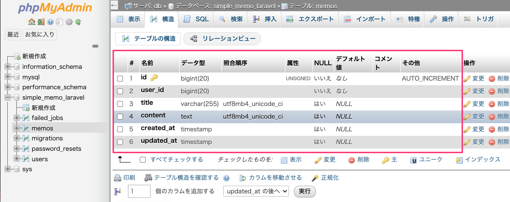

# Memoモデルとマイグレーションファイルの作成

この章では、メモ情報を扱うための Memo モデルと、
データベースに memos テーブルを作成するためのマイグレーションファイルを作成します。

Laravelでは、
- モデル：アプリケーションからDBを操作するためのクラス
- マイグレーション：テーブル構造をコードで管理する仕組み

がセットで使われるのが基本です。

今回はこの2つを同時に作成し、実際にDBへ反映するところまで進めます。

---

本パートのゴール
- Memo モデルを作成する
- memos テーブルを作成するマイグレーションを定義する
- マイグレーションを実行し、DBに反映されていることを確認する

---

## 1. Memoモデルとマイグレーションを作成する
### 1-1. Dockerコンテナに入る
まずは PHP コンテナに入ります。
```shell
docker-compose exec php bash
```
### 1-2. artisanコマンドでモデルとマイグレーションを同時作成
```shell
php artisan make:model Memo -m
```
実行すると、次のように表示されます。
```
Model created successfully.
Created Migration: 2020_11_04_083129_create_memos_table
```

---

## 2. 作成されたファイルについて理解する

このコマンドにより、以下の2つのファイルが自動生成されます。

### 2-1. Memoモデル

>app/Models/Memo.php

このモデルは、memos テーブルを操作するためのクラスです。
Laravelの命名規則により、
- モデル名：Memo（単数・アッパーキャメル）
- テーブル名：memos（複数・スネークケース）
が自動的に紐づきます。

---

### 2-2. マイグレーションファイル

>database/migrations/xxxx_xx_xx_xxxxxx_create_memos_table.php

-m オプションを付けたことで、
モデル名に対応したテーブル作成用マイグレーションが同時に作成されています。

---

### 3. マイグレーションファイルを修正する

作成されたマイグレーションファイルを開きます。

初期状態の up() メソッドは次のようになっています。
```php
public function up()
{
    Schema::create('memos', function (Blueprint $table) {
        $table->id();
        $table->timestamps();
    });
}
```
このままだと、id と created_at / updated_at しか作成されません。
そこで、メモ機能に必要なカラムを追加します。

---

## 3-1. memosテーブルの構成

今回のメモテーブルには、以下の情報を持たせます。

| カラム名 | 内容 |
|---------|------|
| user_id | メモを作成したユーザーID |
| title   | メモのタイトル |
| content | メモの本文 |

---

## 3-2. up() メソッドを修正する
```php
public function up()
{
    Schema::create('memos', function (Blueprint $table) {
        $table->id();
        $table->bigInteger('user_id');
        $table->string('title')->nullable();
        $table->text('content')->nullable();
        $table->timestamps();
    });
}
```
各カラムの意味
> bigInteger('user_id')

→ users.id と紐づくユーザーID（bigint）
>string('title')->nullable()

→ タイトル（varchar 255、未入力可）
>text('content')->nullable()

→ メモ本文（text型、未入力可）

---

## 4. マイグレーションを実行する

マイグレーション定義が完了したら、DBに反映します。
```bash
php artisan migrate
```
成功すると、次のように表示されます。
```
Migrating: 2020_11_04_083129_create_memos_table
Migrated:  2020_11_04_083129_create_memos_table
```

---

## 5. phpMyAdminでテーブル作成を確認する
1.	http://localhost:8086 にアクセス
2.	simple_memo_laravel データベースを選択
3.	memos テーブルが作成されていることを確認
4.	「構造」を開いて、カラム構成を確認


意図した通り、
- id
- user_id
- title
- content
- created_at
- updated_at

が存在していればOKです。

---

まとめ
- php artisan make:model Memo -m で
モデルとマイグレーションを同時作成
- マイグレーションにメモ用のカラムを追加
- php artisan migrate でDBに反映
- phpMyAdminで構造を確認