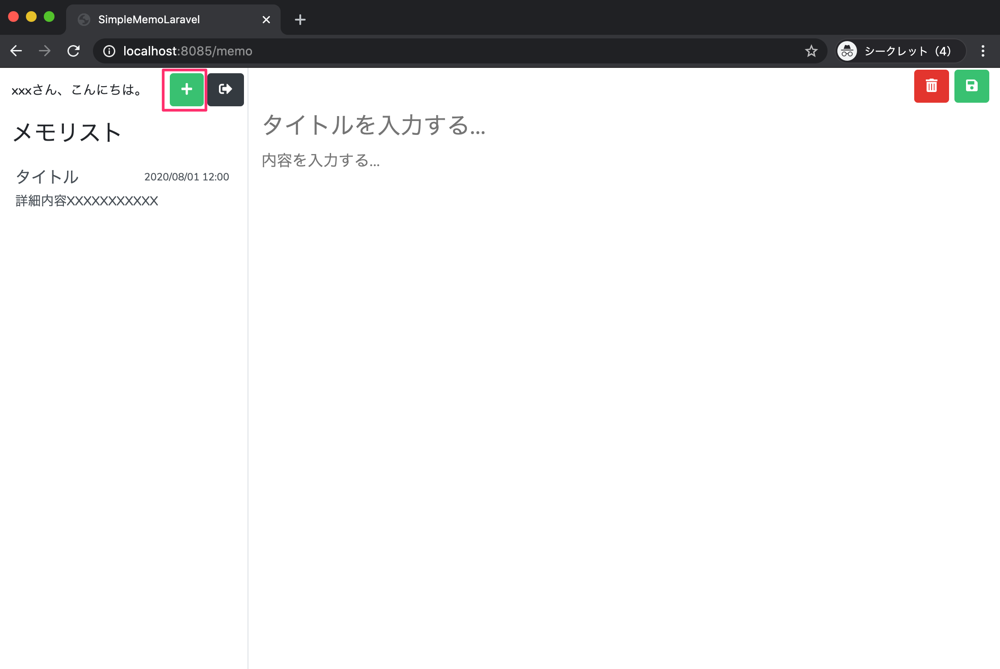
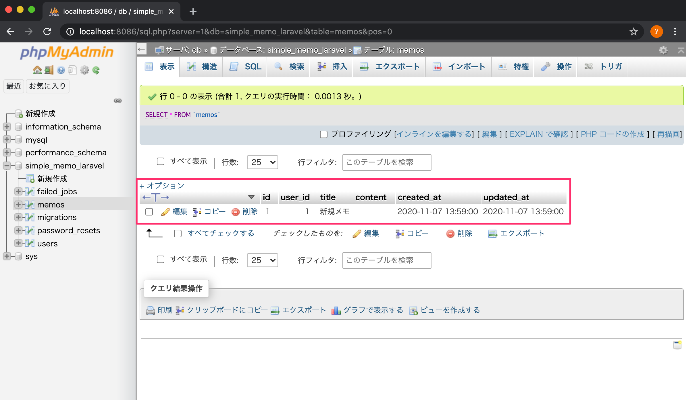

# メモ追加機能（DBに保存まで）を実装する

このパートでできるようになること
>メモ投稿画面の 「＋（追加）」ボタン をクリックすると
>memos テーブルに 新規メモ（新規メモ / 空本文） が登録される



---

## 1. 実装の全体手順
1.	MemoController を作成する
2.	MemoController@index を用意して /memo の表示をController経由にする
3.	既存ルーティングを **Laravel 8形式（配列指定）**に統一する
4.	MemoController@add を作って メモをDBに追加する
5.	Memo モデルに $fillable を設定する
6.	ルート /memo/add を追加する
7.	画面の「＋」ボタンを /memo/add に繋ぐ
8.	動作確認（phpMyAdminで memos を確認）

---

## 2. MemoController を作成する

### 2-1. コンテナに入る
```bash
docker-compose exec php bash
```

### 2-2. コントローラー作成
```bash
php artisan make:controller MemoController
```
作成されるファイル：
>app/Http/Controllers/MemoController.php

---

## 3. メモ投稿画面の初期表示（index）を作る

app/Http/Controllers/MemoController.php を開き、index() を追加します。
```php
class MemoController extends Controller
{
    /**
     * 初期表示
     * @return \Illuminate\Contracts\View\Factory|\Illuminate\View\View
     */
    public function index()
    {
        return view('memo');
    }
}
```

---

## 4. /memo のルーティングを Controller に切り替える

### 4-1. routes/web.php に use を追加

routes/web.php の先頭付近に追記します。
```php
use Illuminate\Support\Facades\Route;
use App\Http\Controllers\MemoController;
```

### 4-2. /memo ルートを修正（クロージャ → Controller）

既存の /memo がクロージャになっている箇所を、以下に置き換えます。
```php
Route::group(['middleware' => ['auth']], function() {
    Route::get('/memo', [MemoController::class, 'index'])->name('memo.index');
});
```

---

## 5. 既存のルートも Laravel 8 形式に統一する

### 5-1. use を追加

routes/web.php に追記します。
```php
use App\Http\Controllers\Auth\LoginController;
use App\Http\Controllers\Auth\RegisterController;
```

### 5-2. 文字列指定のルートを配列指定に変更

以下のように修正します。
```php
Route::get('/', [LoginController::class, 'showLoginForm'])->name('login.index');
Route::get('/user', [RegisterController::class, 'showRegistrationForm'])->name('user.register');
Route::post('/user/register', [RegisterController::class, 'register'])->name('user.exec.register');
```

---

## 6. メモ追加処理（add）を実装する

### 6-1. MemoController に use を追加

app/Http/Controllers/MemoController.php の先頭で追加します。
```php
use App\Models\Memo;
use Illuminate\Support\Facades\Auth;
```

### 6-2. add() を追加

index() の下に add() を追加します。
```php
/**
 * メモの追加
 * @return \Illuminate\Http\RedirectResponse
 */
public function add()
{
    Memo::create([
        'user_id' => Auth::id(),
        'title' => '新規メモ',
        'content' => '',
    ]);

    return redirect()->route('memo.index');
}
```

ポイント
- Auth::id() で ログイン中ユーザーのID を取得
- Memo::create() で memos に1行追加
- 追加後に /memo に戻す（リダイレクト）

---

## 7. Memoモデルに $fillable を設定する

app/Models/Memo.php を開き、$fillable を追加します。
```php
class Memo extends Model
{
    use HasFactory;

    protected $fillable = [
        'user_id',
        'title',
        'content',
    ];
}
```
これがないと create() がエラーになります（MassAssignment例外）

---

## 8. メモ追加用ルートを追加する

routes/web.php の auth グループ内に追記します。
```php
Route::group(['middleware' => ['auth']], function() {
    Route::get('/memo', [MemoController::class, 'index'])->name('memo.index');
    Route::get('/memo/add', [MemoController::class, 'add'])->name('memo.add');
});
```

---

## 9. 画面の「＋」ボタンを add ルートに繋ぐ

resources/views/memo.blade.php の追加ボタンを修正します。

変更前：
```php
<a href="" class="btn btn-success"><i class="fas fa-plus"></i></a>
```

変更後：
```php
<a href="{{ route('memo.add') }}" class="btn btn-success"><i class="fas fa-plus"></i></a>
```

---

## 10. 動作確認
1.	http://localhost:8085/login からログイン
2.	メモ投稿画面で「＋」をクリック

3.	http://localhost:8086（phpMyAdmin）で以下を確認
- DB：simple_memo_laravel
- テーブル：memos
- 1件追加されていること

---

まとめ
- /memo を Controller 経由に変更（MemoController@index）
- /memo/add を追加して MemoController@add でDB登録
- Memo::$fillable を設定して create() を有効化
- 画面の「＋」ボタンを route('memo.add') に接続して完了