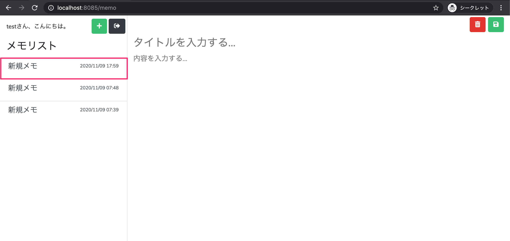
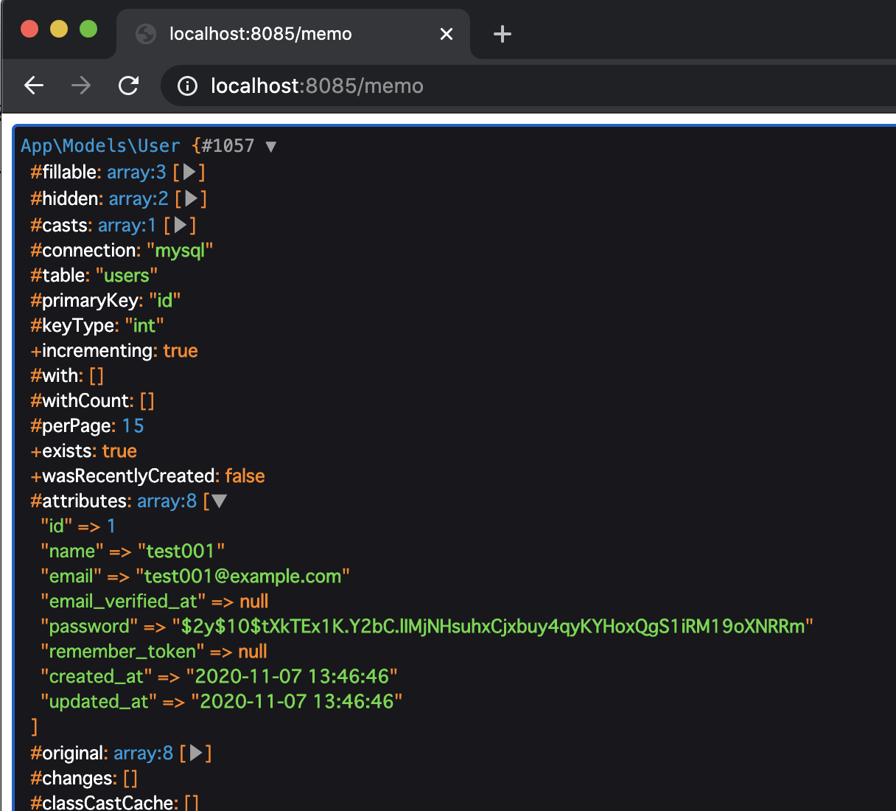

# メモ一覧表示とタイムゾーン設定（Asia/Tokyo）

このパートでできるようになること
- **メモ投稿画面の左側「メモ一覧」**に、DBに保存したメモが表示される
- ログインユーザー名を表示する（長い場合は省略表示）
- Laravelの タイムゾーンを日本時間（Asia/Tokyo） に設定し、更新日時が正しい時刻で表示される

---

## 手順まとめ
1. MemoController@index を修正して 自分のメモ一覧を取得する
2. MemoController に ログインユーザー名取得メソッドを追加する
3. memo.blade.php を修正して ユーザー名＋メモ一覧を表示する
4. config/app.php の timezone を Asia/Tokyo に変更する
5. 動作確認（追加→一覧反映、日時のズレが解消）

---

## 1. MemoController の初期表示処理を修正する

app/Http/Controllers/MemoController.php を開き、index() を次の内容に置き換えます。

### 1-1. indexメソッドを修正（メモ一覧取得＋ビューへ渡す）
```php
public function index()
{
    $memos = Memo::where('user_id', Auth::id())
        ->orderBy('updated_at', 'desc')
        ->get();

    return view('memo', [
        'name' => $this->getLoginUserName(),
        'memos' => $memos
    ]);
}
```

何をしているか
- where('user_id', Auth::id())
→ ログイン中ユーザーのメモだけ取得
- orderBy('updated_at', 'desc')
→ 更新日の新しい順に並び替え
- get()
→ クエリ実行して Collection（一覧） を取得
- view('memo', [...])
→ Bladeに name と memos を渡す
- Blade側では {{ $name }} / {{ $memos }} で参照できる

---

### 1-2. ログインユーザー名取得メソッドを追加

add() メソッドの下に、以下を追加します。
```php
/**
 * ログインユーザー名取得
 * @return string
 */
private function getLoginUserName()
{
    $user = Auth::user();

    $name = '';
    if ($user) {
        if (7 < mb_strlen($user->name)) {
            $name = mb_substr($user->name, 0, 7) . "...";
        } else {
            $name = $user->name;
        }
    }

    return $name;
}
```

何をしているか
- Auth::user() で ログインユーザーのUserモデルを取得
- name が 8文字以上なら7文字＋… に省略



---

## 2. memo.blade.php を修正して一覧表示する

resources/views/memo.blade.php を開いて修正します。

---

### 2-1. ユーザー名表示を差し替える

変更前：

> xxxさん、こんにちは。

変更後：

> {{ $name }}さん、こんにちは。


---

### 2-2. 仮の一覧を削除して、メモ一覧ループを追加する

既存の仮リスト（タイトル/日時/本文の固定表示）を削除

削除後、以下を追加します。
```php
<div class="left-memo-list list-group-flush p-0">
    @if ($memos->count() === 0)
        <div class="pl-3 pt-3 h5 text-info text-center">
            <i class="far fa-surprise"></i>メモがありません。
        </div>
    @endif

    @foreach ($memos as $memo)
        <a href="" class="list-group-item list-group-item-action">
            <div class="d-flex w-100 justify-content-between">
                <h5 class="mb-1">{{ $memo->title }}</h5>
                <small>{{ date('Y/m/d H:i', strtotime($memo->updated_at)) }}</small>
            </div>
            <p class="mb-1">
                @if (mb_strlen($memo->content) <= 100)
                    {{ $memo->content }}
                @else
                    {{ mb_substr($memo->content, 0, 100) . "..." }}
                @endif
            </p>
        </a>
    @endforeach
</div>
```

表示ロジックの要点
- @if ($memos->count() === 0)
→ 0件なら「メモがありません。」
- @foreach ($memos as $memo)
→ メモを1件ずつ表示
- updated_at は Y/m/d H:i 形式で表示
- content は 100文字超なら省略（…）

---

## 3. Laravel のタイムゾーンを日本時間にする

メモの登録日時がPCの現在時刻とズレる場合、Laravelのタイムゾーンが UTC のままです。

config/app.php を開いて timezone を修正します。

変更前：
```php
'timezone' => 'UTC',
```

変更後：
```php
'timezone' => 'Asia/Tokyo',
```

補足
- UTC と日本時間は +9時間の差があるため、UTCのままだと表示がズレます。

---

## 4. 動作確認
1. http://localhost:8085/login でログイン
2. メモ投稿画面に移動
3. 「＋」でメモを追加
4. 左のメモ一覧に 追加したメモが表示されることを確認
5. 表示される日時が PCの現在時刻と一致することを確認（timezone反映）

---

## 5. Eloquent の Collection について（最低限）

get() の結果は配列ではなく Collection です。

よく使う例：
- 件数：$memos->count()
- ソート：$memos->sortBy('カラム') / sortByDesc('カラム')
- 配列化：$memos->toArray()

---

まとめ
- MemoController@index で 自分のメモだけ取得してビューに渡す
- memo.blade.php を @foreach で回して 一覧表示
- config/app.php の timezone を Asia/Tokyo にして時刻ズレを解消