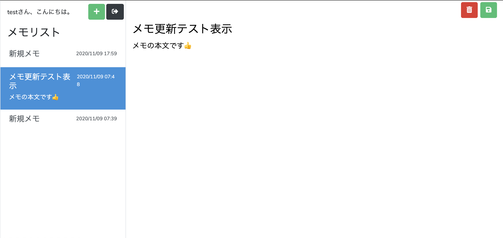
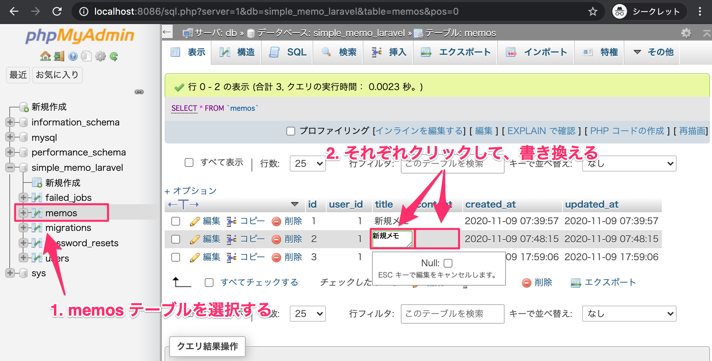

# メモ選択機能の実装（左で選んだメモを右に表示）

このパートでできるようになること
- 左のメモ一覧でクリックしたメモを 右側の編集エリアに表示
- 選択中のメモを 一覧側でハイライト（active）
- 選択状態を セッションに保持して、画面遷移しても維持



---

手順まとめ
1. MemoController に selectメソッドを追加（クリックされたメモをセッションへ保存）
2. MemoController@index を修正し、選択中メモをビューへ渡す
3. routes/web.php に 選択用ルートを追加
4. memo.blade.php を修正し、
- 一覧クリックで memo.select を呼ぶ（idを送る）
- 右側に選択メモを表示（未選択時は案内を表示）
5. 動作確認

---

## 1. MemoController に「メモ選択」メソッドを追加する

app/Http/Controllers/MemoController.php を開き、add() の下に select() を追加します。
```php
/**
 * メモの選択
 * @param Request $request
 * @return \Illuminate\Http\RedirectResponse
 */
public function select(Request $request)
{
    $memo = Memo::find($request->id);
    session()->put('select_memo', $memo);

    return redirect()->route('memo.index');
}
```

ポイント
- Memo::find($request->id)
→ memosテーブルの id（主キー）で1件取得
- session()->put('select_memo', $memo)
→ 選択したメモを セッションに保存
- 最後は memo.index に戻して 通常の画面表示フローに合流

---

## 2. indexメソッドを修正して「選択中メモ」をビューに渡す

index() の view() の第2引数に、選択中メモを追加します。

変更前（例）：
```php
return view('memo', [
    'name' => $this->getLoginUserName(),
    'memos' => $memos
]);
```

変更後：
```php
return view('memo', [
    'name' => $this->getLoginUserName(),
    'memos' => $memos,
    'select_memo' => session()->get('select_memo')
]);
```

ポイント
- session()->get('select_memo') で、select() が保存したメモを取り出す
- Blade側では {{ $select_memo }} を使って表示可能になる

---

## 3. ルーティングを追加する

routes/web.php の auth グループ内に 1行追加します。
```php
Route::group(['middleware' => ['auth']], function() {
    Route::get('/memo', [MemoController::class, 'index'])->name('memo.index');
    Route::get('/memo/add', [MemoController::class, 'add'])->name('memo.add');

    Route::get('/memo/select', [MemoController::class, 'select'])->name('memo.select');
});
```

---

## 4. memo.blade.php を修正する

### 4-1. メモ一覧のリンクを「選択ルート」へ変更（idを渡す）

resources/views/memo.blade.php の一覧ループ内 a タグを修正します。

変更前：
```php
<a href="" class="list-group-item list-group-item-action">
```

変更後：
```php
<a href="{{ route('memo.select', ['id' => $memo->id]) }}"
   class="list-group-item list-group-item-action
   @if ($select_memo) {{ $select_memo->id == $memo->id ? 'active' : '' }} @endif">
```

ここでやっていること
- route('memo.select', ['id' => $memo->id])
→ クリックしたメモのidをクエリに付けて /memo/select?id=xx へ遷移
- active クラス付与
→ 選択中のメモだけ背景色が変わる（Bootstrapの active）

---

## 4-2. 右側の表示を「選択中メモがあるか」で分岐

右側エリアの既存フォーム（空のvalue等）は削除し、以下に置き換えます。
```php
<div class="col-9 h-100">
    @if ($select_memo)
        <form class="w-100 h-100" method="post">
            @csrf
            <input type="hidden" name="edit_id" value="{{ $select_memo->id }}" />

            <div id="memo-menu">
                <button type="submit" class="btn btn-danger" formaction="">
                    <i class="fas fa-trash-alt"></i>
                </button>
                <button type="submit" class="btn btn-success" formaction="">
                    <i class="fas fa-save"></i>
                </button>
            </div>

            <input type="text" id="memo-title" name="edit_title"
                   placeholder="タイトルを入力する..."
                   value="{{ $select_memo->title }}" />

            <textarea id="memo-content" name="edit_content"
                      placeholder="内容を入力する...">{{ $select_memo->content }}</textarea>
        </form>
    @else
        <div class="mt-3 alert alert-info">
            <i class="fas fa-info-circle"></i>メモを新規作成するか選択してください。
        </div>
    @endif
</div>
```

ポイント
- @if ($select_memo)
→ 選択されていればフォームに値を入れて表示
- 未選択なら案内メッセージを表示
- edit_id を hidden で保持
→ 次の「保存/削除」実装で、対象メモを特定できるようにする準備

---

## 5. 動作確認
1. http://localhost:8085 にアクセスしてログイン
2. 最初は未選択のため、右側に案内が出ることを確認
3. 左のメモをクリック
4. 右側にタイトル・本文が表示され、左の選択行が active になることを確認

確認が分かりづらい場合（おすすめ）

phpMyAdminで memos のタイトル/本文を1件だけ変更して、選択すると右側に反映されるかを見ると確実です。



---

まとめ
- 左のクリック → /memo/select?id=xx → select() がメモ取得 → セッション保存
- /memo に戻る → index() がセッションから選択メモを取り出してビューへ渡す
- Bladeで 選択状態に応じて表示・ハイライトを行う