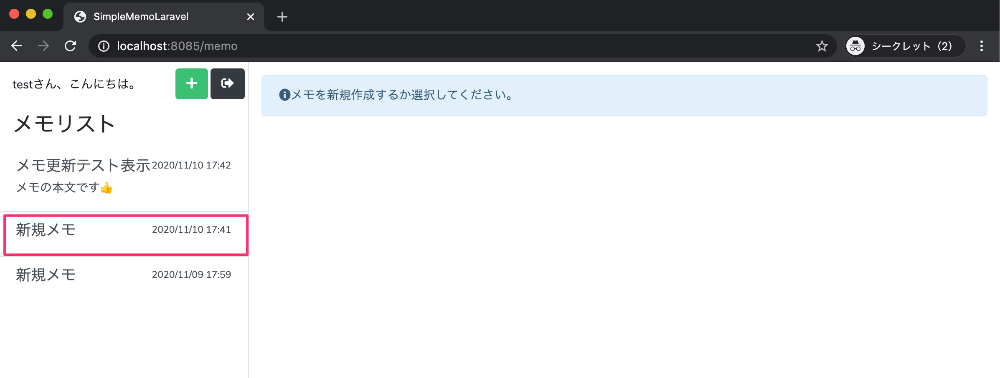
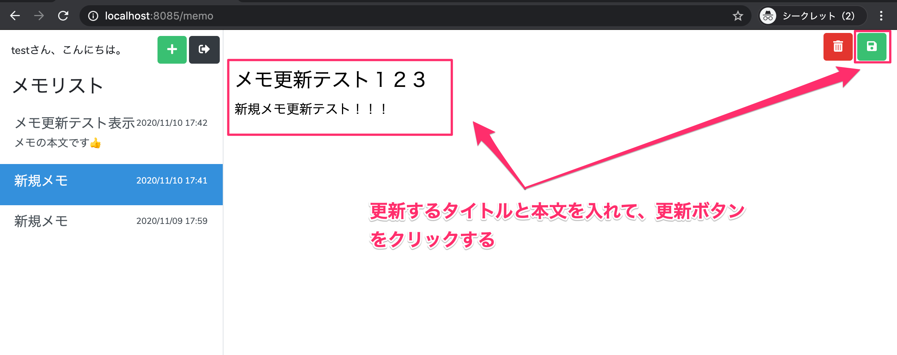

# メモ更新機能の実装（タイトル・本文を更新して保存する）

このパートでできるようになること
- 右側フォームで タイトル/本文を編集 → 更新ボタン（保存） を押す
- memos テーブルの対象レコードが更新される
- 更新後は updated_at が新しくなるため、一覧（降順）で 一番上に移動する

---

手順まとめ
1.	MemoController に updateメソッドを追加する
2.	routes/web.php に 更新用POSTルートを追加する
3.	memo.blade.php の 更新ボタンに memo.update を指定する
4.	動作確認する

---

## 1. MemoController にメモ更新処理を追加する

app/Http/Controllers/MemoController.php を開き、add() の下に update() を追加します。

```php
/**
 * メモの更新
 * @param Request $request
 * @return \Illuminate\Http\RedirectResponse
 */
public function update(Request $request)
{
    $memo = Memo::find($request->edit_id);
    $memo->title = $request->edit_title;
    $memo->content = $request->edit_content;

    if ($memo->update()) {
        session()->put('select_memo', $memo);
    } else {
        session()->remove('select_memo');
    }

    return redirect()->route('memo.index');
}
```

処理の流れ
- Memo::find($request->edit_id)
→ hiddenで送られてきた edit_id を使って対象メモを取得
- title / content をフォームの値で上書き
- $memo->update() でDB更新
- 更新成功なら、選択中メモ（セッション）も最新の内容に差し替え
失敗なら選択状態を消して安全側に倒す

---

## 2. ルーティングに更新用ルートを追加する

routes/web.php の auth グループ内に post ルートを追加します。
```php
Route::group(['middleware' => ['auth']], function() {
    Route::get('/memo', [MemoController::class, 'index'])->name('memo.index');
    Route::get('/memo/add', [MemoController::class, 'add'])->name('memo.add');
    Route::get('/memo/select', [MemoController::class, 'select'])->name('memo.select');

    Route::post('/memo/update', [MemoController::class, 'update'])->name('memo.update');
});
```

---

## 3. メモ投稿画面の更新ボタンにルートを指定する

resources/views/memo.blade.php を開き、更新ボタン（保存アイコン）の formaction を修正します。

変更前：
```php
<button type="submit" class="btn btn-success" formaction="">
    <i class="fas fa-save"></i>
</button>
```

変更後：
```php
<button type="submit" class="btn btn-success" formaction="{{ route('memo.update') }}">
    <i class="fas fa-save"></i>
</button>
```

このフォームでコントローラが参照する値

name 属性がキーになって $request から取得できます。
```php
<input type="hidden" name="edit_id" value="{{ $select_memo->id }}" />
<input type="text" name="edit_title" value="{{ $select_memo->title }}" />
<textarea name="edit_content">{{ $select_memo->content }}</textarea>
```

- $request->edit_id
- $request->edit_title
- $request->edit_content

---

4. 動作確認
	1.	http://localhost:8085 にアクセス → ログイン
	2.	更新したいメモを左一覧から選択
	3.	タイトル/本文を変更
	4.	更新ボタン（保存）をクリック
	5.	一覧の先頭に更新したメモが来ることを確認





一覧が先頭に来る理由は、index() が更新日の降順で取得しているためです。

>$memos = Memo::where('user_id', Auth::id())
>    ->orderBy('updated_at', 'desc')
>    ->get();


---

まとめ
- **updateルート（POST）**を追加し、フォームの保存ボタンから送信
- Memo::find(edit_id) → title/content をセット → update()
- 成功時はセッションの選択中メモも最新化
- updated_at desc なので更新メモが一覧の先頭に来る