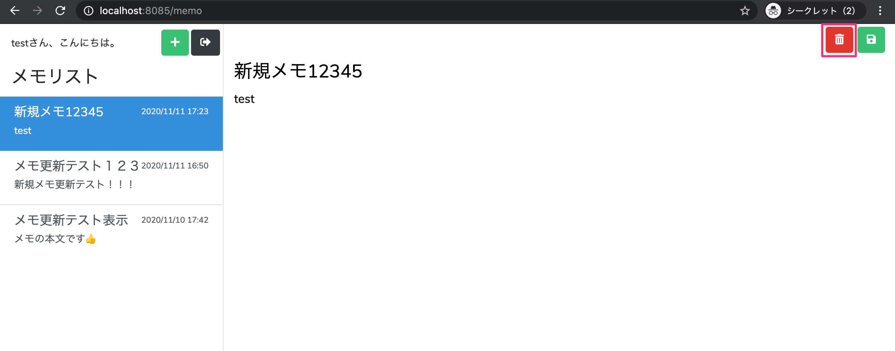
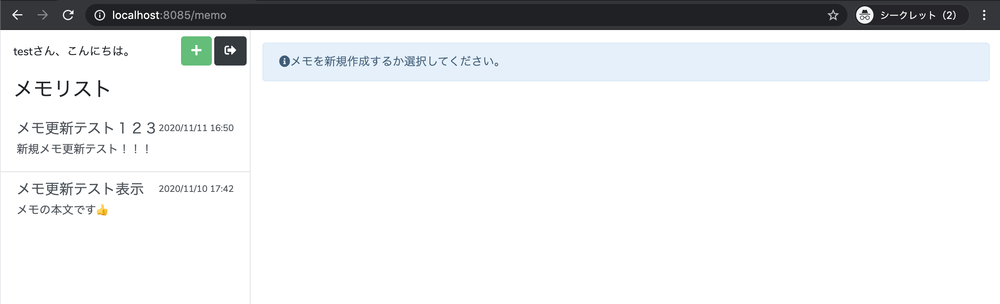

# メモ削除機能の実装（削除ボタンでメモを消す）

このパートでできるようになること
- 右側フォームの 削除ボタン（ゴミ箱） を押すと、選択中のメモが削除される
- 削除後は 一覧から消える（再表示されない）
- 選択中メモ（セッション）も消すため、右側の表示も「未選択状態」になる

---

手順まとめ
1.	MemoController に deleteメソッドを追加
2.	routes/web.php に 削除用POSTルートを追加
3.	memo.blade.php の 削除ボタンに memo.delete を指定
4.	動作確認

---

## 1. MemoController に削除処理を追加する

app/Http/Controllers/MemoController.php を開き、add() の下に delete() を追加します。

```php
/**
 * メモの削除
 * @param Request $request
 * @return \Illuminate\Http\RedirectResponse
 */
public function delete(Request $request)
{
    Memo::find($request->edit_id)->delete();
    session()->remove('select_memo');

    return redirect()->route('memo.index');
}
```

処理の流れ
- Memo::find($request->edit_id) で対象メモ取得
- ->delete() で 物理削除（DBから削除）
- session()->remove('select_memo') で選択状態も解除
- 最後に memo.index へリダイレクト
→ index() が走るので一覧が最新になり、削除したメモが表示されなくなる

---

## 2. ルーティングに削除用ルートを追加する

routes/web.php の auth グループ内に、memo.delete を追加します。

```php
Route::group(['middleware' => ['auth']], function() {
    Route::get('/memo', [MemoController::class, 'index'])->name('memo.index');
    Route::get('/memo/add', [MemoController::class, 'add'])->name('memo.add');
    Route::get('/memo/select', [MemoController::class, 'select'])->name('memo.select');
    Route::post('/memo/update', [MemoController::class, 'update'])->name('memo.update');

    Route::post('/memo/delete', [MemoController::class, 'delete'])->name('memo.delete');
});
```

---

## 3. メモ投稿画面の削除ボタンにルートを指定する

resources/views/memo.blade.php を開き、削除ボタンの formaction を修正します。

変更前：

```php
<button type="submit" class="btn btn-danger" formaction="">
    <i class="fas fa-trash-alt"></i>
</button>
```

変更後：

```php
<button type="submit" class="btn btn-danger" formaction="{{ route('memo.delete') }}">
    <i class="fas fa-trash-alt"></i>
</button>
```

コントローラが使う値（重要）

同じフォーム内に edit_id があるため、削除対象を特定できます。
```php
<input type="hidden" name="edit_id" value="{{ $select_memo->id }}" />
```
削除側はこれを使って以下を実行します。

>Memo::find($request->edit_id)->delete();


---

## 4. 動作確認
1.	http://localhost:8085 にアクセスしてログイン
2.	左の一覧から削除したいメモを選択

3.	右側の 削除ボタン（ゴミ箱） をクリック


4.	一覧から消えること、右側が未選択表示になることを確認


5.	phpMyAdmin（memos テーブル）でも該当レコードが消えていることを確認

---

補足：物理削除と論理削除
- 今回は 物理削除（DBから行ごと削除）
- Laravelは 論理削除（SoftDeletes） も簡単に対応可能
- deleted_at カラムを追加し、データ自体は残して「削除済み」扱いにする方式
- 必要になった時点で導入すると良いです

---

まとめ
- MemoController@delete を追加して Memo::find(edit_id)->delete()
- /memo/delete（POST）をルーティングに追加
- memo.blade.php の削除ボタン formaction を route('memo.delete') に変更
- 削除後はセッションも外し、一覧・表示が自然に更新される