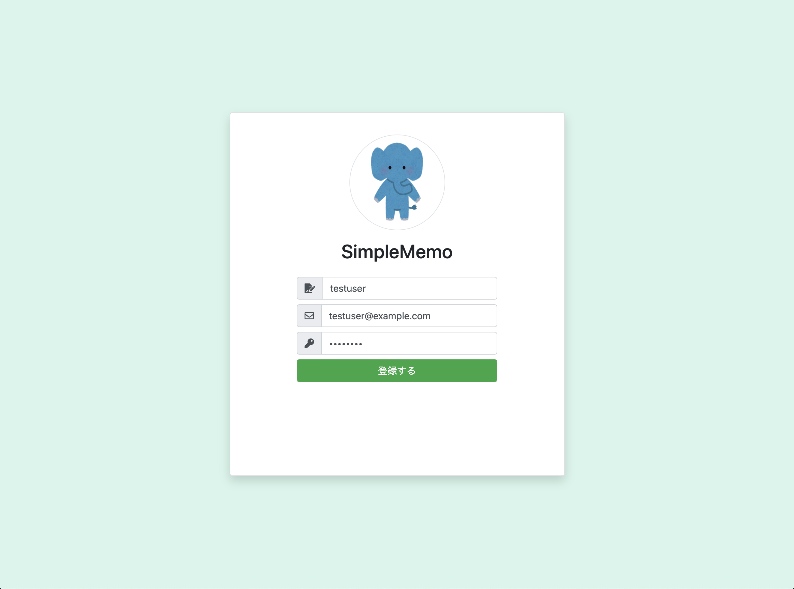

# アプリ設計

作成日: 2025年7月12日 2:05

# ✨ Evernote風メモアプリ - ユーザー登録から画面遷移・データベース設計まで

このページでは、**Evernote風メモアプリ**の画面と画面遷移、データベース設計について解説します。

---

## 📝 ユーザー登録画面

ユーザー登録画面では、以下の情報を入力して新規アカウントを作成します。

- **名前**
- **メールアドレス**
- **パスワード**

登録が完了すると、自動的にメモ投稿画面へ遷移します。

> 📷 イメージ画面
> 
> 
> 
> 

---

## 🔑 ログイン画面

ログイン画面では、すでに作成済みのアカウントでログインが可能です。

入力する項目は以下の通りです。

- **メールアドレス**
- **パスワード**

ログイン後はメモ画面が表示されます。

また、画面内の「アカウントを作成」リンクをクリックすると、ユーザー登録画面に遷移できます。

> 📷 イメージ画面
> 
> 
> 
> 

---

## ✍️ メモ投稿画面

メモ投稿画面では、ユーザーが投稿したメモの一覧と新規メモの入力フォームが表示されます。

**操作方法**

- ➕ **プラスボタン**
新規のメモを追加
- 🗑️ **ゴミ箱ボタン**
メモを削除
- 💾 **フロッピーアイコン**
入力内容を保存
- 🚪 **ログアウトボタン（プラスボタン右のアイコン）**
ログアウトしてログイン画面に戻る

> 📷 イメージ画面
> 
> 
> 
> 

---

## 🔄 画面遷移の流れ

アプリケーションの画面遷移は以下の通りです。

1. **最初のアクセス**
    - ログイン画面が表示される
2. **ログイン**
    - メールアドレスとパスワードでログイン
    - メモ投稿画面へ遷移
3. **アカウントがない場合**
    - 「アカウントを作成」リンクをクリック
    - ユーザー登録画面へ遷移
    - 登録完了後はメモ投稿画面へ遷移
4. **ログアウト**
    - メモ投稿画面からログアウト
    - ログイン画面へ戻る

> 📷 画面遷移イメージ
> 
> 
> 
> 

---

## 🗄️ データベース設計

ユーザー情報やメモ情報はデータベースに保存します。

フォームの入力内容をもとに、以下のテーブルが必要です。

- `users` テーブル（ユーザー情報）
- `memos` テーブル（メモ情報）

---

### 📊 PHPバージョンのテーブル構成

PHPバージョンでは、シンプルに以下のカラムを用意します。

### **usersテーブル**

| カラム名 | 説明 |
| --- | --- |
| name | ユーザー名 |
| email | メールアドレス |
| password | パスワード |
| created_at | 作成日時 |
| updated_at | 更新日時 |

### **memosテーブル**

| カラム名 | 説明 |
| --- | --- |
| user_id | usersテーブルのid（外部キー） |
| title | メモのタイトル |
| content | メモの内容 |
| created_at | 作成日時 |
| updated_at | 更新日時 |

> 🖼️ ER図イメージ
> 
> 
> *（ここにER図を挿入）*
> 
> 
> 

1人のユーザーに複数のメモが紐づく構成です。

---

### 📊 Laravelバージョンのテーブル構成

Laravelバージョンでも基本的には同じテーブルを用意しますが、Laravelの標準機能に合わせて`users`テーブルに追加のカラムが含まれます。

### **追加されるカラム**

| カラム名 | 説明 |
| --- | --- |
| email_verified_at | メール確認用（今回は使用しない） |
| remember_token | ログイン保持用（今回は使用しない） |

これらのカラムはLaravelの認証機能で自動的に扱われるもので、今回のアプリでは特に使用しません。

常に空のままで問題ありません。

> 🖼️ ER図イメージ
> 
> 
> 
> 

---

## ✅ まとめ

これで、以下のポイントを確認できました。

- 各画面の役割と操作方法
- 画面遷移の流れ
- データを保存するテーブル設計

これらをもとに実装を進めていきましょう！