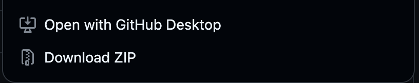

# 初回：環境構築

作成日: 2025年7月12日 1:43

# 🛠️ PHPバージョン開発環境の立ち上げガイド

このガイドでは、Evernote風メモアプリ（PHPバージョン）を開発するためのDocker環境の立ち上げ手順を解説します。

---

## 📦 1. GitHubよりコードをダウンロード

以下にアクセスして「Download ZIP」を押してください

[https://github.com/kojicollege/memo-php.git](https://github.com/kojicollege/memo-php.git)



ダウンロードしたファイル名を「memo-php」に変更し、ディレクトリに移動してください

```bash
cd memo-php
```

---

## **🚀 2. Docker Composeで環境を起動**

次のコマンドを実行して環境を立ち上げます。

```
docker-compose up -d
```

⚠️ **注意:**

初回起動時は必要なイメージや依存パッケージのインストールが行われるため、数分程度かかります。

---

### **✅ 実行例（完了時の表示）**

インストールが進むと、最終的に以下のように... doneが表示されます。

```
Creating php_simple_memo_mysql ... done
Creating php_simple_memo_phpmyadmin ... done
Creating php_simple_memo_php        ... done
Creating php_simple_memo_nginx      ... done
```

この表示が出たら、MySQL、phpMyAdmin、PHP、Nginxがすべて起動しています。

---

## **🖥️ 3. 起動状況を確認する**

起動しているコンテナを確認するため、以下のコマンドを実行します。

```
docker ps
```

**実行例（省略表示）**

```
PORTS                                NAMES
80/tcp, 0.0.0.0:8080->8080/tcp       php_simple_memo_nginx
9000/tcp                             php_simple_memo_php
0.0.0.0:8081->80/tcp                 php_simple_memo_phpmyadmin
33060/tcp, 0.0.0.0:13306->3306/tcp   php_simple_memo_mysql
```

NAMESに

✅ php_simple_memo_nginx

✅ php_simple_memo_php

✅ php_simple_memo_phpmyadmin

✅ php_simple_memo_mysql

が表示されていれば、起動完了です。

---

## **🛑 4. 環境を停止する**

開発を終えたら、次のコマンドで環境を停止できます。

```
docker-compose down
```

停止後はリソースを消費しません。

---

## **▶️ 5. 環境を再起動する**

再度開発や動作確認を行いたい場合は、以下のコマンドで起動してください。

```
docker-compose up -d
```

---

## 👀6. 動作確認

以下URLにアクセス

[http://localhost:8080/](http://localhost:8080/)

