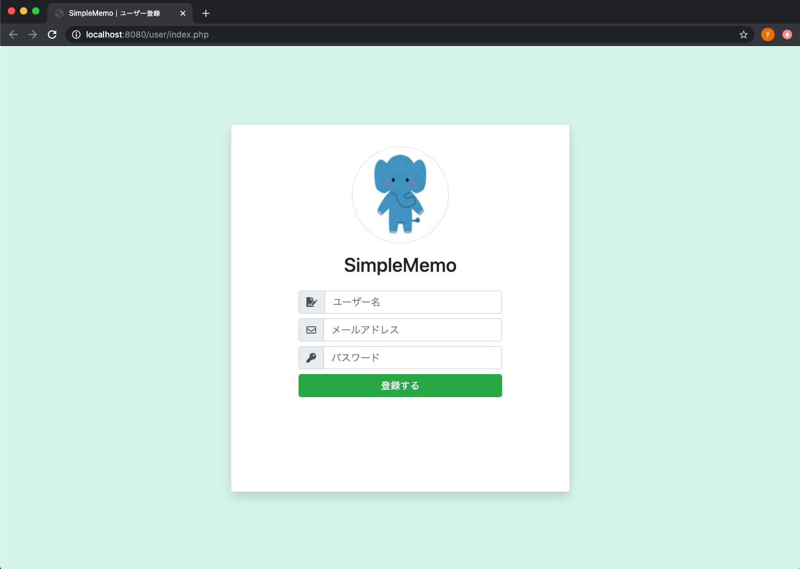

# 第2回：ユーザー登録画面の作成

作成日: 2025年7月12日 13:33

# 📝 ユーザー登録画面を作成しよう

このパートでは、**ユーザー登録画面**を作成して、動作確認まで行います。

---

## 🎯 本パートの目標物

こちらの「ユーザー登録画面」を完成させます。

> 📷 イメージ
> 
> 
> 
> 

---

## 🛠️ 作成の流れ

以下の手順で進めます。

1. `user/index.php` を開く
2. 記載しているHTMLを上書きで貼り付ける
3. 実際に画面が表示されるか動作確認する

それでは、実際に作成していきましょう。

---

## ✍️ ユーザー登録画面を編集する

### 📄 `docker_simple_memo_php/user/index.php`

```php
<!DOCTYPE html>
<html lang="ja">
    <?php
        include_once "../common/header.php";
        echo getHeader("ユーザー登録");
    ?>
    <body>
        <div class="d-flex align-items-center justify-content-center h-100">
            <form method="post" action="../memo/">
                <div class="card rounded login-card-width shadow">
                    <div class="card-body">
                        <div class="rounded-circle mx-auto border-gray border d-flex mt-3 icon-circle">
                            
                        </div>
                        <div class="d-flex justify-content-center">
                            <div class="mt-3 h2">SimpleMemo</div>
                        </div>
                        <div class="row mt-3">
                            <div class="offset-2 col-8 offset-2">
                                <label class="input-group w-100">
                                    <span class="input-group-prepend">
                                        <span class="input-group-text"><i class="fas fa-file-signature"></i></span>
                                    </span>
                                    <input type="text" name="user_name" class="form-control" placeholder="ユーザー名" autocomplete="off" maxlength="255" />
                                </label>
                                <label class="input-group w-100">
                                    <span class="input-group-prepend">
                                        <span class="input-group-text"><i class="far fa-envelope"></i></span>
                                    </span>
                                    <input type="text" name="user_email" class="form-control" placeholder="メールアドレス" autocomplete="off" maxlength="255" />
                                </label>
                                <label class="input-group w-100">
                                    <span class="input-group-prepend">
                                        <span class="input-group-text"><i class="fas fa-key"></i></span>
                                    </span>
                                    <input type="password" name="user_password" class="form-control" placeholder="パスワード" autocomplete="off" maxlength="255" />
                                </label>
                                <button type="submit" class="form-control btn btn-success">
                                    登録する
                                </button>
                            </div>
                        </div>
                    </div>
                </div>
            </form>
        </div>
    </body>
</html>
```

---

## **🔍 コードのポイント**

PHPコードで注目すべき部分はこちらです。

```
<?php
    include_once "../common/header.php";
    echo getHeader("ユーザー登録");
?>
```

- **include_once**
    
    ../common/header.php を読み込み、ヘッダー共通部分の関数を使えるようにしています。
    
- **getHeader関数**
    
    getHeader("ユーザー登録") によって、ページタイトルが「ユーザー登録」になります。
    
    返ってきたHTMLを echo で出力しています。
    

---

## **🚀 動作確認**

それでは、画面を表示してみましょう。

---

### **1️⃣ Dockerを起動する**

まだDockerが立ち上がっていない場合は、以下のコマンドを実行してください。

```bash
cd memo-php
docker-compose up -d
```

> ⚠️ 既に起動している場合はこの手順は不要です。
> 

---

### **2️⃣ URLにアクセスする**

ブラウザで次のURLを開きます。

[http://localhost:8080/user/index.php](http://localhost:8080/user/index.php)

---

### **3️⃣ 表示を確認する**

以下のようにユーザー登録画面が表示されればOKです。

> 📷
> 
> 
> **画面イメージ**
> 
> 
> 

ブラウザのタブに「ユーザー登録」と表示されているか確認してみましょう。

---

## **🕵️ ページタイトルを確認する**

実際にHTMLソースを見てみます。

### **Chromeの場合**

1. 登録画面上で右クリック
2. 「ページのソースを表示」をクリック

```
<title>ユーザー登録</title>
```

このように <title> タグに「ユーザー登録」が反映されていることが確認できます。

> 📷
> 
> 
> **確認イメージ**
> 
> 
> 

---

## **🎉 完成！**

以上で、ユーザー登録ページの作成と動作確認が完了しました。

次のステップに進みましょう！