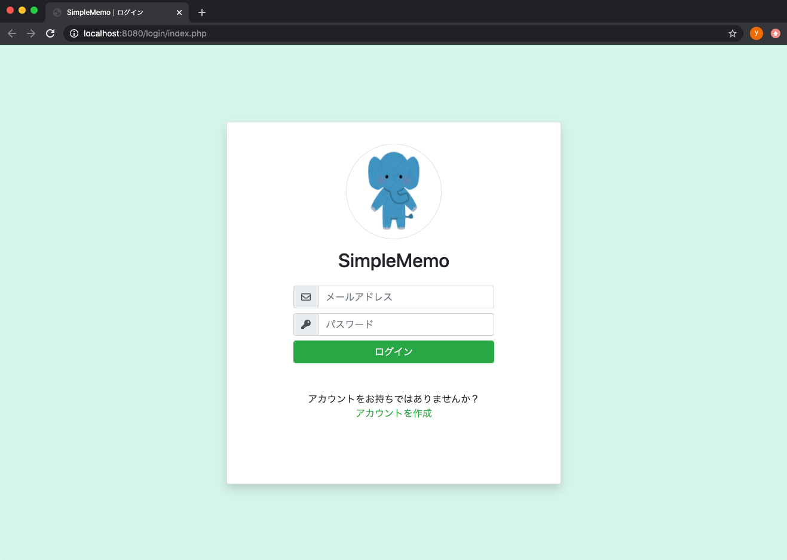

# 第3回：ログイン画面の作成

作成日: 2025年7月12日 15:56

# 🔑 ログイン画面を作成しよう

このパートでは、**ログイン画面**を作成し、画面が正しく表示されるか確認します。

---

## 🎯 本パートの目標物

こちらのログイン画面を完成させます。

> 📷 イメージ
> 
> 
> 
> 

---

## 🛠️ 作成の流れ

以下の手順で進めていきます。

1. `login/index.php` を開く
2. 記載しているHTMLを上書きで貼り付ける
3. 実際に画面が表示されるか動作確認する

それでは、実際に作成していきましょう。

---

## ✍️ ログイン画面を編集する

前回までに作成したログイン画面を、以下のコードで**上書き**してください。

### 📄 `docker_simple_memo_php/login/index.php`

```php
<!DOCTYPE html>
<html lang="ja">
    <?php
        include_once "../common/header.php";
        echo getHeader("ログイン");
    ?>
    <body>
        <div class="d-flex align-items-center justify-content-center h-100">
            <form method="post" action="../memo/">
                <div class="card rounded login-card-width shadow">
                    <div class="card-body">
                        <div class="rounded-circle mx-auto border-gray border d-flex mt-3 icon-circle">
                            
                        </div>
                        <div class="d-flex justify-content-center">
                            <div class="mt-3 h2">SimpleMemo</div>
                        </div>
                        <div class="row mt-3">
                            <div class="offset-2 col-8 offset-2">
                                <label class="input-group w-100">
                                    <span class="input-group-prepend">
                                        <span class="input-group-text"><i class="far fa-envelope"></i></span>
                                    </span>
                                    <input type="text" name="user_email" class="form-control" placeholder="メールアドレス" autocomplete="off" />
                                </label>
                                <label class="input-group w-100">
                                    <span class="input-group-prepend">
                                        <span class="input-group-text"><i class="fas fa-key"></i></span>
                                    </span>
                                    <input type="password" name="user_password" class="form-control" placeholder="パスワード" autocomplete="off" />
                                </label>
                                <button type="submit" class="form-control btn btn-success">
                                   ログイン
                                </button>
                            </div>
                        </div>
                        <div class="mt-5">
                            <div class="d-flex justify-content-center">
                                アカウントをお持ちではありませんか？
                            </div>
                            <div class="d-flex justify-content-center">
                                <a href="../user/" class="text-success">アカウントを作成</a>
                            </div>
                        </div>
                    </div>
                </div>
            </form>
        </div>
    </body>
</html>
```

## 🚀 動作確認

それでは、画面を表示して確認してみましょう。

---

### 1️⃣ Dockerを起動する

まだDockerを立ち上げていない場合は、以下のコマンドを実行します。

```bash
cd memo-php
docker-compose up -d
```

> ⚠️既に起動している場合はこの手順は不要です。
> 

---

### 2️⃣ URLにアクセスする

ブラウザで次のURLを開きます。

[http://localhost:8080/login/index.php](http://localhost:8080/login/index.php)

---

### 3️⃣ 表示を確認する

以下のようにログイン画面が表示されていればOKです。

> 📷 画面イメージ
> 
> 
> 
> 

---

## 💡 ポイント

このログイン画面も、ユーザー登録画面と同様に**getHeader関数**を使っています。

```php
include_once "../common/header.php";
echo getHeader("ログイン");

```

共通処理を`header.php`にまとめておくことで、各ページで`head`タグの中身を繰り返し書かずに済み、とても便利です。

---

## ✅ 完成！

これでログインページの作成と動作確認が完了しました。

次のパートに進んで、**メモ投稿ページ**を作成していきましょう！