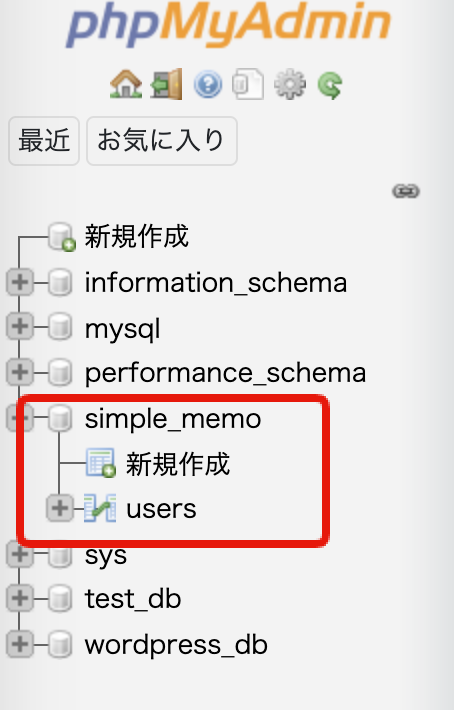

# 第5回：ユーザーテーブルの作成

作成日: 2025年7月13日 0:19

# 🗄️ データベースとユーザーテーブルを作成しよう

このパートでは、**データベースとユーザーテーブル**を作成し、今後のアプリケーション開発で利用できるようにします。

---

## 🎯 本パートの目標物

最終的に、`http://127.0.0.1:8081/` (phpMyAdmin) にアクセスすると、**simple_memoデータベース**と**usersテーブル**が作成済みで表示される状態を目指します。

> 📷 イメージ
> 
> 
> 
> 

---

## 🛠️ 作成の流れ

進め方は以下の通りです。

1. `http://127.0.0.1:8081/` にアクセス
2. SQLタブを開く
3. データベース作成用のSQLを実行
4. 作成した `simple_memo` データベースを選択
5. SQLタブを開く
6. ユーザーテーブル作成用のSQLを実行

それでは、データベースから作成していきましょう。

---

## 🗃️ データベースを作成する

Docker環境を立ち上げると、すでに**phpMyAdmin**が利用可能になっています。

以下のURLにアクセスしてください。

[http://127.0.0.1:8081/](http://127.0.0.1:8081/)

---

アクセスすると、次のような画面が表示されます。

> 📷 画面イメージ
> 
> 
> 
> 

画面上部の赤枠「**SQL**」タブをクリックします。

---

テキストエリアと実行ボタンが表示されるので、下記のSQLを貼り付けて実行してください。

```sql
CREATE DATABASE simple_memo DEFAULT CHARACTER SET utf8mb4 COLLATE utf8mb4_unicode_ci;
```

実行が完了すると、左側のデータベース一覧に**simple_memo**が表示されます。

> 📷 画面イメージ
> 
> 
> 
> 

---

### 💡 CREATE DATABASE文の解説

今回のSQLは次の通りです。

```sql
CREATE DATABASE simple_memo DEFAULT CHARACTER SET utf8mb4 COLLATE utf8mb4_unicode_ci;
```

ポイントを簡単に整理します。

✅ **`simple_memo`**

データベース名。自由に変更可能ですが、本教材ではこの名前を使用します。

✅ **`DEFAULT CHARACTER SET utf8mb4`**

文字コードをutf8mb4に設定します。

utf8mb4はUTF-8の拡張版で、**絵文字なども格納できます**。

✅ **`COLLATE utf8mb4_unicode_ci`**

照合順序（文字の比較ルール）を設定しています。

指定しなくても問題はありませんが、明示的に指定しています。

---

## 🗄️ ユーザーテーブルを作成する

次に、**usersテーブル**を作成します。

これは実際にユーザーのデータを格納するためのテーブルです。

---

### 1️⃣ データベースを選択

先ほど作成した `simple_memo` を左メニューから選択します。

---

### 2️⃣ SQLタブを開く

`simple_memo` を選択した状態で、画面上部の**SQL**タブをクリックします。

---

### 3️⃣ SQLを貼り付けて実行

以下のSQLをテキストエリアに貼り付けて実行します。

```sql
sql
コピーする編集する
CREATE TABLE users (
    id BIGINT NOT NULL AUTO_INCREMENT,
    name VARCHAR(255),
    email VARCHAR(255),
    password VARCHAR(255),
    created_at DATETIME DEFAULT CURRENT_TIMESTAMP,
    updated_at DATETIME DEFAULT CURRENT_TIMESTAMP,
    PRIMARY KEY (id)
);

```

実行が完了すると、左側に**usersテーブル**が表示されます。

> 📷 画面イメージ
> 
> 
> 
> 

---

### 💡 CREATE TABLE文の解説

今回のSQLは以下のように構成されています。

```sql
sql
コピーする編集する
CREATE TABLE users (
    id BIGINT NOT NULL AUTO_INCREMENT,
    name VARCHAR(255),
    email VARCHAR(255),
    password VARCHAR(255),
    created_at DATETIME DEFAULT CURRENT_TIMESTAMP,
    updated_at DATETIME DEFAULT CURRENT_TIMESTAMP,
    PRIMARY KEY (id)
);

```

それぞれのポイントを見てみましょう。

| カラム名 | データ型 | 説明 |
| --- | --- | --- |
| `id` | BIGINT | ユーザーID（自動採番） |
| `name` | VARCHAR(255) | ユーザー名 |
| `email` | VARCHAR(255) | メールアドレス |
| `password` | VARCHAR(255) | パスワード |
| `created_at` | DATETIME | 登録日時（デフォルト: 現在日時） |
| `updated_at` | DATETIME | 更新日時（デフォルト: 現在日時） |

---

### 🔹 特に重要な指定

- **`NOT NULL`**
    
    `NULL`を許容しない設定。空データを防ぎます。
    
- **`AUTO_INCREMENT`**
    
    新規データ登録時に自動的にIDが1ずつ増加します。
    
- **`DEFAULT CURRENT_TIMESTAMP`**
    
    初期値として現在日時を設定します。
    
- **`PRIMARY KEY (id)`**
    
    主キー（レコードを一意に識別するキー）として `id` を指定しています。
    

---

作成後にテーブルの構造を確認したい場合は、phpMyAdminで**usersテーブルを選択 → 構造タブ**をクリックしてください。

設定内容が一覧で確認できます。

---

## ✅ 完成！

以上で、**simple_memoデータベース**と**usersテーブル**が作成できました。