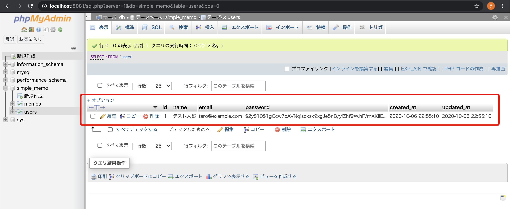

# 第7回：ユーザー登録機能追加

作成日: 2025年7月13日 1:01

# ✨ ユーザー登録処理を実装しよう

このパートでは、**ユーザー登録機能**を実装し、登録したユーザー情報がデータベースに保存されるようにします。

---

## 🎯 本パートの目標物

ユーザー登録画面から情報を入力すると、データベースの`users`テーブルにデータが登録される状態を目指します。

> 📷 イメージ
> 
> 
> 
> 

---

## 🛠️ 作成の流れ

進め方は以下のとおりです。

1. `user/action`ディレクトリを作成
2. `register.php`ファイルを作成
3. 登録処理を記述
4. フォームのアクションを修正
5. 動作確認

それでは、まずディレクトリの作成から始めましょう。

---

## 🗂️ 登録処理用のファイルを作成する

まず`user`ディレクトリ配下に`action`ディレクトリを作成してください。

作成後は以下のような構成になります。

```bash
├── user
│ ├── action
│ │ └── register.php
│ └── index.php
```

この`register.php`に処理を記述します。

---

> 💡 ポイント
> 
> 
> 画面を表示するPHPファイルと、処理を行うPHPファイルを分けることで、コードの見通しが良くなります。
> 

---

## ✍️ 登録処理を記述する

### 1️⃣ パラメータ取得とDB接続

まず、以下のコードを`register.php`に記載してください。

### 📄 `user/action/register.php`

```php
<?php
    require '../../common/database.php';

    // パラメータ取得
    $user_name = $_POST['user_name'];
    $user_email = $_POST['user_email'];
    $user_password = $_POST['user_password'];

    // DB接続
    $database_handler = getDatabaseConnection();
```

### 💡 解説

- `require`
    
    共通関数`getDatabaseConnection()`を使えるようにしています。
    
- `$_POST`
    
    フォームから送信された値を受け取っています。
    

---

### 2️⃣ データベースへ登録する

続けて、データベースへデータをINSERTする処理を追記します。

```php
try {
    // インサートSQLを作成して実行
    if ($statement = $database_handler->prepare('INSERT INTO users (name, email, password) VALUES (:name, :email, :password)')) {
        $password = password_hash($user_password, PASSWORD_DEFAULT);

        $statement->bindParam(':name', htmlspecialchars($user_name));
        $statement->bindParam(':email', $user_email);
        $statement->bindParam(':password', $password);
        $statement->execute();
    }
} catch (Throwable $e) {
    echo $e->getMessage();
    exit;
}

// メモ投稿画面にリダイレクト
header('Location: ../../memo/');
exit;
```

### 💡 処理の流れ

1. **SQL準備**
    
    ```php
    $statement = $database_handler->prepare('INSERT INTO users ...')
    ```
    
    `prepare()`でSQLを準備します。
    
2. **パスワードのハッシュ化**
    
    ```php
    $password = password_hash($user_password, PASSWORD_DEFAULT);
    ```
    
    セキュリティのため、ハッシュ化してから保存します。
    
3. **値をバインド**
    
    ```php
    $statement->bindParam(':name', htmlspecialchars($user_name));
    ```
    
    `htmlspecialchars()`で特殊文字をエスケープ。
    
4. **実行**
    
    ```php
    $statement->execute();
    ```
    
5. **リダイレクト**
    
    ```php
    header('Location: ../../memo/');
    exit;
    ```
    
    登録後はメモ投稿画面に移動します。
    

---

## 📝 フォームのアクションを修正する

これまでフォームのアクションはメモ投稿画面になっていました。

修正しましょう。

### 📄 `user/index.php`

**修正前**

```html
<form method="post" action="../memo/">
```

**修正後**

```html
<form method="post" action="./action/register.php">
```

---

## 🚀 動作確認

1. ブラウザで以下にアクセス
    
    [http://localhost:8080/user/index.php](http://localhost:8080/user/index.php)
    
2. ユーザー名・メールアドレス・パスワードを入力
3. **登録する**をクリック

> 📷 イメージ
> 
> 
> 
> 

登録が成功すると、メモ投稿画面に遷移します。

---

## 📂 データベースの確認

phpMyAdminにアクセスして、登録内容を確認してみましょう。

[http://localhost:8081](http://localhost:8081/)

`simple_memo > users`テーブルを開くと、登録したデータが表示されます。

> 📷 イメージ
> 
> 
> 
> 

---

## 💡 実装のポイント

### 🔹 INSERT文

今回のSQLは以下のように記述しました。

```sql
INSERT INTO users (name, email, password) VALUES (:name, :email, :password)
```

`created_at`や`updated_at`はデフォルト値（現在日時）が自動的に入ります。

---

### 🔹 password_hash()

パスワードはハッシュ化して保存しています。

```php
$password = password_hash($user_password, PASSWORD_DEFAULT);
```

こうすることで、万一データベースが漏洩してもパスワードを守れます。

---

### 🔹 htmlspecialchars()

特殊文字を変換し、クロスサイトスクリプティング（XSS）を防ぎます。

---

## 🎉 完成！

これで、**ユーザー登録処理**の実装が完了しました。

次は、登録したユーザー情報を使ってログイン処理を実装していきましょう。