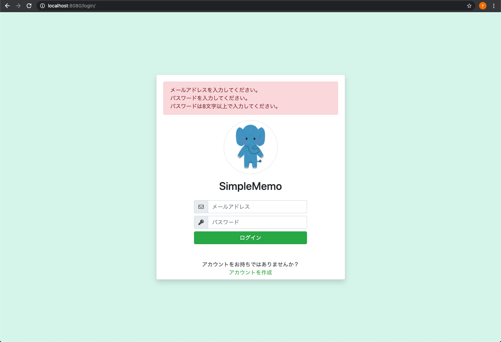

# 第10回：ログイン機能追加

作成日: 2025年7月27日 0:33

# 🔐PHPログイン処理とバリデーションの実装ガイド

---

## 🎯本パートのゴール

- ログイン処理の実装
- ログイン画面へのバリデーション追加
- セッション管理でユーザー情報を保持

---

## 🗂️ディレクトリ構成

```
login/
├── action/
│   └── login.php
└── index.php

```

---

## 📝login.php の実装手順

### 1. 共通関数の読み込みとパラメータ取得

```php
<?php
session_start();
require '../../common/validation.php';
require '../../common/database.php';

// パラメータ取得
$user_email = $_POST['user_email'];
$user_password = $_POST['user_password'];

```

### 2. バリデーション処理

```php
$_SESSION['errors'] = [];

// 空チェック
emptyCheck($_SESSION['errors'], $user_email, "メールアドレスを入力してください。");
emptyCheck($_SESSION['errors'], $user_password, "パスワードを入力してください。");

// 文字数チェック
stringMaxSizeCheck($_SESSION['errors'], $user_email, "メールアドレスは255文字以内で入力してください。");
stringMaxSizeCheck($_SESSION['errors'], $user_password, "パスワードは255文字以内で入力してください。");
stringMinSizeCheck($_SESSION['errors'], $user_password, "パスワードは8文字以上で入力してください。");

if (!$_SESSION['errors']) {
    mailAddressCheck($_SESSION['errors'], $user_email, "正しいメールアドレスを入力してください。");
    halfAlphanumericCheck($_SESSION['errors'], $user_password, "パスワードは半角英数字で入力してください。");
}

if ($_SESSION['errors']) {
    header('Location: ../../login/');
    exit;
}

```

---

## 🔐ログイン認証処理の実装

```php
$database_handler = getDatabaseConnection();
if ($statement = $database_handler->prepare('SELECT id, name, password FROM users WHERE email = :user_email')) {
    $statement->bindParam(':user_email', $user_email);
    $statement->execute();

    $user = $statement->fetch(PDO::FETCH_ASSOC);
    if (!$user || !password_verify($user_password, $user['password'])) {
        $_SESSION['errors'] = ['メールアドレスまたはパスワードが間違っています。'];
        header('Location: ../../login/');
        exit;
    }

    $_SESSION['user'] = [
        'name' => $user['name'],
        'id' => $user['id']
    ];

    header('Location: ../../memo/');
    exit;
}

```

---

## 🖥️login/index.php の修正

### 1. セッション開始

```php
<?php
session_start();
?>

```

### 2. formタグの修正

```html
<form method="post" action="./action/login.php">

```

### 3. エラー表示箇所の追加

```php
<?php
if (isset($_SESSION['errors'])) {
    echo '<div class="alert alert-danger" role="alert">';
    foreach ($_SESSION['errors'] as $error) {
        echo "<div>{$error}</div>";
    }
    echo '</div>';
    unset($_SESSION['errors']);
}
?>

```

---

## ✅動作確認チェックリスト

- 空欄のままログイン



- パスワードが8文字未満


- メールアドレスの形式不正


- 全角パスワード


- 正しい情報でログイン


- 存在しないメールアドレス


- パスワード間違い


---

## ✏️ユーザー登録処理にもセッション追加

```php
// 登録成功後に追加
$_SESSION['user'] = [
    'name' => $user_name,
    'id' => $database_handler->lastInsertId()
];

```

---

## 🔚まとめ

このパートでは、ログイン機能とそれに伴うバリデーション処理、セッション管理について実装しました。次はログイン済みユーザーのみがアクセス可能なページ制御などを実装していきます。

---