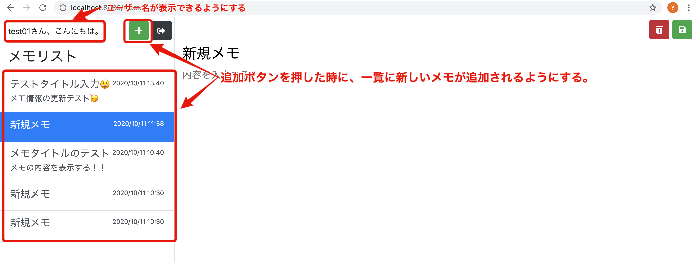

# 第１３回：メモ追加機能を実装

作成日: 2025年8月9日 15:54

# 📝 PHPでメモ追加機能を実装する（ユーザー名表示付き）

このパートでは、**メモ投稿画面でログイン中のユーザー名を表示**し、**追加ボタンから新しいメモを作成できるようにする**機能を実装します。

---

## 🎯 目標

- メモ投稿画面に **ログインユーザー名** を表示
- **追加ボタン** を押すと、新しいメモが一覧に表示される
    
    
    

---

## 🛠 実装の流れ

1. `memo` ディレクトリに `action` ディレクトリを作成
2. `memo/action/add.php` を作成し、メモ追加処理を記述
3. `memo/index.php` を修正し、追加ボタンからメモ追加可能にする
4. 動作確認（phpMyAdminでレコード追加を確認）
5. メモ一覧表示に反映し、ユーザー名とメモリストを出力

---

## 1. メモ投稿画面の全体フロー

- **追加**
    1. 追加ボタンを押す
    2. 新しいメモが作成され一覧に追加
- **更新**
    1. 一覧から更新対象メモを選択
    2. タイトル・本文を編集し更新
- **削除**
    1. 一覧から削除対象メモを選択
    2. 削除ボタンで削除

---

## 2. `add.php` の作成

まずは追加処理用のディレクトリとファイルを作成します。

```
memo/
├── action/
│   └── add.php
└── index.php

```

**`memo/action/add.php`**

```php
<?php
require '../../common/auth.php';
require '../../common/database.php';

if (!isLogin()) {
    header('Location: ../login/');
    exit;
}

$user_id = getLoginUserId();
$database_handler = getDatabaseConnection();

try {
    $title = "新規メモ";
    if ($statement = $database_handler->prepare(
        "INSERT INTO memos (user_id, title, content) VALUES(:user_id, :title, null)"
    )) {
        $statement->bindParam(":user_id", $user_id);
        $statement->bindParam(":title", $title);
        $statement->execute();
    }

    $_SESSION['select_memo'] = [
        'id'      => $database_handler->lastInsertId(),
        'title'   => $title,
        'content' => '',
    ];
} catch (Throwable $e) {
    echo $e->getMessage();
    exit;
}

header('Location: ../../memo');
exit;

```

📌 **ポイント**

- `isLogin()` で未ログインならログイン画面へリダイレクト
- `$title` に「新規メモ」をセットして `INSERT`
- `lastInsertId()` で直前に追加したIDを取得し、セッションに保存

---

## 3. 追加ボタンの修正

`memo/index.php` の追加ボタン部分を以下のように変更します。

```php
<a href="./action/add.php" class="btn btn-success">
    <i class="fas fa-plus"></i>
</a>

```

これでクリック時に `add.php` が実行され、メモが追加されます。

---

## 4. データ取得と一覧表示の準備

**ユーザーの全メモを取得し、変数に格納します。**

`memo/index.php` 冒頭に以下を追加：

```php
require '../common/auth.php';
require '../common/database.php';

if (!isLogin()) {
    header('Location: ../login/');
    exit;
}

$user_name = getLoginUserName();
$user_id   = getLoginUserId();

$memos = [];
$database_handler = getDatabaseConnection();
if ($statement = $database_handler->prepare(
    "SELECT id, title, content, updated_at
     FROM memos
     WHERE user_id = :user_id
     ORDER BY updated_at DESC"
)) {
    $statement->bindParam(':user_id', $user_id);
    $statement->execute();

    while ($result = $statement->fetch(PDO::FETCH_ASSOC)) {
        array_push($memos, $result);
    }
}

$edit_id = "";
if (isset($_SESSION['select_memo'])) {
    $edit_memo   = $_SESSION['select_memo'];
    $edit_id     = $edit_memo['id'] ?? "";
    $edit_title  = $edit_memo['title'] ?? "";
    $edit_content= $edit_memo['content'] ?? "";
}

```

---

## 5. ユーザー名を表示

```php
<?php echo $user_name; ?>さん、こんにちは。

```

---

## 6. メモ一覧表示

```php
<div class="left-memo-list list-group-flush p-0">
    <?php if (empty($memos)): ?>
        <div class="pl-3 pt-3 h5 text-info text-center">
            <i class="far fa-surprise"></i>メモがありません。
        </div>
    <?php endif; ?>

    <?php foreach ($memos as $memo): ?>
        <a href="./action/select.php?id=<?php echo $memo['id']; ?>"
           class="list-group-item list-group-item-action <?php echo $edit_id == $memo['id'] ? 'active' : ''; ?>">
            <div class="d-flex w-100 justify-content-between">
                <h5 class="mb-1"><?php echo $memo["title"]; ?></h5>
                <small><?php echo date('Y/m/d H:i', strtotime($memo['updated_at'])); ?></small>
            </div>
            <p class="mb-1">
                <?php
                echo mb_strlen($memo['content']) <= 100
                    ? $memo['content']
                    : mb_substr($memo['content'], 0, 100) . "...";
                ?>
            </p>
        </a>
    <?php endforeach; ?>
</div>

```

📌 **ポイント**

- データがなければ「メモがありません」表示


- `active` クラスで選択中メモを強調


- 本文は100文字まで表示し、それ以上は省略

---

## 7. 動作確認

1. ログイン後にメモ投稿画面を開く
2. 追加ボタンをクリック
3. phpMyAdmin で `memos` テーブルに新規レコード追加を確認
4. 画面にユーザー名と新規メモが表示されることを確認

---

## ✅ まとめ

- ログインユーザー名の表示機能を追加
- 追加ボタンで新しいメモを作成可能に
- 登録したメモは一覧表示に反映される