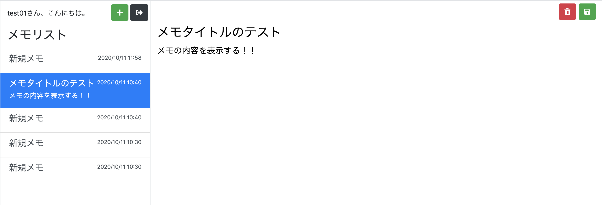

# 第14回：メモ選択機能を実装

作成日: 2025年9月28日 1:17

# 🗂 メモ選択機能を実装しよう（一覧 → 編集エリアに反映）

このパートでは、**左のメモリストで選択した内容が右の編集エリアに表示**されるようにします。

> 画面イメージ
> 
> 
> 
> 
> 左：メモ一覧／右：編集エリア（選択メモのタイトル・本文）
> 

---

## 🎯 本パートの目標物

- メモ一覧でメモをクリック → **右の編集フォームに選択内容が反映**される

---

## 🛠 進め方（全体の流れ）

1. `memo/action` に `select.php` を作成
2. `select.php` に**メモ選択機能**を実装
3. `memo/index.php` を修正（**選択されたメモを表示**）
4. 動作確認

---

## 1) ファイルを作成する

`memo` ディレクトリ配下に `action/select.php` を新規作成します。

```bash
├── memo
│   ├── action
│   │   ├── add.php
│   │   └── select.php   ← 新規
│   └── index.php
```

---

## 2) メモ選択機能を実装する

URL パラメータで渡されたメモ ID を使って DB から該当メモを取得し、**選択中メモ情報をセッションに格納**してメモ画面へ戻します。

### 📄 `memo/action/select.php`

```php
<?php
require '../../common/auth.php';
require '../../common/database.php';

if (!isLogin()) {
    header('Location: ../login/');
    exit;
}

$id      = $_GET['id'];        // クリックされたメモID（URLパラメータ）
$user_id = getLoginUserId();   // ログインユーザーID

$database_handler = getDatabaseConnection();
if ($statement = $database_handler->prepare(
    "SELECT id, title, content FROM memos WHERE id = :id AND user_id = :user_id"
)) {
    $statement->bindParam(":id", $id);
    $statement->bindParam(":user_id", $user_id);
    $statement->execute();
    $result = $statement->fetch(PDO::FETCH_ASSOC);
}

// 選択中メモをセッションに保存
$_SESSION['select_memo'] = [
    'id'      => $result['id'],
    'title'   => $result['title'],
    'content' => $result['content'],
];

// メモ画面へ戻す
header('Location: ../../memo/');
exit;
```

### **💡 解説**

- $_GET['id']：./action/select.php?id=... の **URL パラメータ**からメモ ID を取得
- SQL は **メモ ID + ユーザー ID** で絞り込み（他ユーザーのメモ取得を防止）
- 取得結果は $_SESSION['select_memo'] に保存 → memo/index.php で参照

---

## **3) メモ投稿画面で選択結果を表示する**

### **(A) ダミーの固定フォームを削除**

以下の **固定値のフォーム**部分を削除します（あとで差し替えます）。

```php
<div class="col-9 h-100">
    <!-- -------------- ここから削除する --------------- -->
    <form class="w-100 h-100" method="post">
        <input type="hidden" name="edit_id" value="" />
        <div id="memo-menu">
            <button type="submit" class="btn btn-danger" formaction=""><i class="fas fa-trash-alt"></i></button>
            <button type="submit" class="btn btn-success" formaction=""><i class="fas fa-save"></i></button>
        </div>
        <input type="text" id="memo-title" name="edit_title" placeholder="タイトルを入力する..." value="" />
        <textarea id="memo-content" name="edit_content" placeholder="内容を入力する..."></textarea>
    </form>
    <!-- -------------- ここまで削除する --------------- -->
</div>
```

**(B) 選択中メモを反映するフォームに差し替え**

```php
<div class="col-9 h-100">
    <!-- -------------- ここから追加する -------------- -->
    <?php if (isset($_SESSION['select_memo'])): ?>
        <form class="w-100 h-100" method="post">
            <input type="hidden" name="edit_id" value="<?php echo $edit_id; ?>" />
            <div id="memo-menu">
                <button type="submit" class="btn btn-danger" formaction="./action/delete.php">
                    <i class="fas fa-trash-alt"></i>
                </button>
                <button type="submit" class="btn btn-success" formaction="./action/update.php">
                    <i class="fas fa-save"></i>
                </button>
            </div>
            <input
                type="text"
                id="memo-title"
                name="edit_title"
                placeholder="タイトルを入力する..."
                value="<?php echo $edit_title; ?>"
            />
            <textarea
                id="memo-content"
                name="edit_content"
                placeholder="内容を入力する..."
            ><?php echo $edit_content; ?></textarea>
        </form>
    <?php else: ?>
        <div class="mt-3 alert alert-info">
            <i class="fas fa-info-circle"></i>
            メモを新規作成するか選択してください。
        </div>
    <?php endif; ?>
    <!-- -------------- ここまで追加する -------------- -->
</div>
```

### **🔎 ポイント**

- isset($_SESSION['select_memo'])：選択中メモがあるかで表示を出し分け
- edit_id を **hidden** で保持（更新・削除時に使用）
- delete.php / update.php は未実装のため、現時点で押すと 404（後続パートで実装）

---

## **4) 動作確認**

1. http://localhost:8080/memo にアクセス（未ログインならログイン）
2. メモを複数件追加（足りなければ「＋」で作成）
3. **一覧のメモをクリック**
    - → 右の編集エリアに **タイトル／本文** が反映される
4. 表示が分かりづらい場合は phpMyAdmin（http://localhost:8081）で memos テーブルの **タイトル・本文** を直接編集し、再表示して確認

---

## **✅ まとめ**

- memo/action/select.php で **選択メモの取得 → セッション保存 → 画面戻し** を実装
- memo/index.php で **セッションの選択メモ**を使い、編集エリアへ反映
- これで **「一覧で選ぶ → 右で編集」** の流れが完成しました

> 次回は、**更新（保存）処理,削除処理**
>