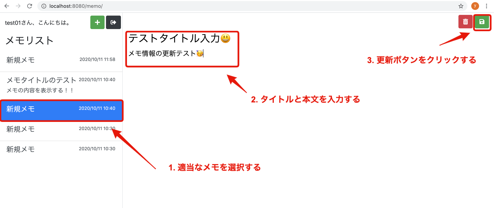

# 第16回：メモ更新機能を実装

作成日: 2025年9月28日 1:29

# 📝 メモ更新機能を実装しよう

このパートでは、**メモを選択してタイトルと本文を編集し、更新ボタンをクリックすると内容が更新される**ようにします。

---

## 🎯 本パートの目標物

- メモリストからメモを選択
- タイトル・本文を編集
- **更新ボタンをクリック → データベースが更新され一覧に反映**



---

## 🛠 実装の流れ

1. `memo/action/update.php` を作成
2. 更新処理を実装
3. 動作確認

---

## 1) ファイル作成

`memo/action` ディレクトリに `update.php` を新規作成してください。

```php
├── memo
│   ├── action
│   │   ├── add.php
│   │   ├── select.php
│   │   └── update.php   ← 新規追加
│   └── index.php
```

---

## 2) 更新処理を実装する

### 📄 `memo/action/update.php`

```php
<?php
require '../../common/auth.php';
require '../../common/database.php';

if (!isLogin()) {
    header('Location: ../login/');
    exit;
}

// フォームから送信された値を取得
$edit_id     = $_POST['edit_id'];
$edit_title  = $_POST['edit_title'];
$edit_content = $_POST['edit_content'];

$user_id = getLoginUserId();
$database_handler = getDatabaseConnection();

try {
    // 1. データ更新処理
    if ($statement = $database_handler->prepare(
        "UPDATE memos
         SET title = :title, content = :content, updated_at = NOW()
         WHERE id = :edit_id AND user_id = :user_id"
    )) {
        $statement->bindParam(":title", htmlspecialchars($edit_title));
        $statement->bindParam(":content", htmlspecialchars($edit_content));
        $statement->bindParam(":edit_id", $edit_id);
        $statement->bindParam(":user_id", $user_id);
        $statement->execute();
    }

    // 2. 更新後データを取得してセッションに保持
    if ($statement = $database_handler->prepare(
        "SELECT id, title, content FROM memos WHERE id = :edit_id AND user_id = :user_id"
    )) {
        $statement->bindParam(":edit_id", $edit_id);
        $statement->bindParam(":user_id", $user_id);
        $statement->execute();

        $result = $statement->fetch(PDO::FETCH_ASSOC);
        $_SESSION['select_memo'] = [
            'id'      => $result['id'],
            'title'   => $result['title'],
            'content' => $result['content'],
        ];
    }
} catch (Throwable $e) {
    echo $e->getMessage();
    exit;
}

// 更新後にメモ画面へ戻る
header('Location: ../../memo');
exit;
```

---

## **💡 コードの解説**

1. **ログインチェック**
    
    未ログインならログイン画面にリダイレクト
    
2. **フォームデータの受け取り**

```php
$edit_id = $_POST['edit_id'];
$edit_title = $_POST['edit_title'];
$edit_content = $_POST['edit_content'];
```

- edit_id : 編集中のメモ ID
- edit_title : 編集後のタイトル
- edit_content : 編集後の本文
1. **UPDATE 文でデータを更新**

```sql
UPDATE memos 
SET title = :title, content = :content, updated_at = NOW()
WHERE id = :edit_id AND user_id = :user_id
```

- NOW() を使って updated_at を更新時刻に変更
1. **更新したデータを再取得し、セッションに反映**
- $_SESSION['select_memo'] に保存
- 再度画面を開いたときに更新後の内容が反映される

---

## **3) 動作確認**

1. http://localhost:8080/memo にアクセス（ログイン状態で）
2. 任意のメモを選択
3. タイトルや本文を編集 → **更新ボタン** をクリック
4. 一覧が更新され、編集内容が反映されることを確認

> ⚡ ポイント
> 

> 一覧は updated_at の降順で並んでいるため、
> 
> 
> **更新したメモが一番上に移動**
> 

---

## **✅ まとめ**

- memo/action/update.php を実装し、選択中メモを更新できるようにした
- 更新時には updated_at を現在時刻に更新 → 一覧で最新順に並ぶ
- セッションの select_memo も更新されるので編集画面に即時反映