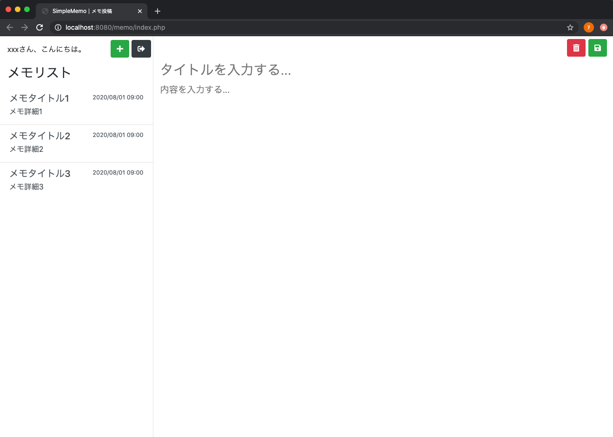

# 第３回：メモ投稿画面の作成

作成日: 2025年7月12日 16:02

# 📝 メモ投稿画面を作成しよう

このパートでは、**メモ投稿画面**を作成し、画面遷移を含めた動作確認を行います。

---

## 🎯 本パートの目標物

こちらのメモ投稿画面を完成させます。

> 📷 イメージ
> 
> 
> 
> 

---

## 🛠️ 作成の流れ

以下の手順で進めていきます。

1. `memo/index.php` を開く
2. 記載しているHTMLを上書きで貼り付ける
3. 実際に画面が表示されるか確認する
4. すべての画面を通して動作確認する

それでは、実際に作成していきましょう。

---

## ✍️ メモ投稿画面を編集する

前回までに作成したメモ投稿画面を、以下のコードで**上書き**してください。

### 📄 `docker_simple_memo_php/memo/index.php`

```php
<!DOCTYPE html>
<html lang="ja">
    <?php
        include_once "../common/header.php";
        echo getHeader("メモ投稿");
    ?>
    <body class="bg-white">
        <div class="h-100">
            <div class="row h-100 m-0 p-0">
                <div class="col-3 h-100 m-0 p-0 border-left border-right border-gray">
                    <div class="left-memo-menu d-flex justify-content-between pt-2">
                        <div class="pl-3 pt-2">
                            xxxさん、こんにちは。
                        </div>
                        <div class="pr-1">
                            <a href="" class="btn btn-success"><i class="fas fa-plus"></i></a>
                            <a href="../login/" class="btn btn-dark"><i class="fas fa-sign-out-alt"></i></a>
                        </div>
                    </div>
                    <div class="left-memo-title h3 pl-3 pt-3">
                        メモリスト
                    </div>
                    <div class="left-memo-list list-group-flush p-0">
                        <a href="#" class="list-group-item list-group-item-action">
                            <div class="d-flex w-100 justify-content-between">
                                <h5 class="mb-1">メモタイトル1</h5>
                                <small>2020/08/01 09:00</small>
                            </div>
                            <p class="mb-1">
                                メモ詳細1
                            </p>
                        </a>
                        <a href="#" class="list-group-item list-group-item-action">
                            <div class="d-flex w-100 justify-content-between">
                                <h5 class="mb-1">メモタイトル2</h5>
                                <small>2020/08/01 09:00</small>
                            </div>
                            <p class="mb-1">
                                メモ詳細2
                            </p>
                        </a>
                        <a href="#" class="list-group-item list-group-item-action">
                            <div class="d-flex w-100 justify-content-between">
                                <h5 class="mb-1">メモタイトル3</h5>
                                <small>2020/08/01 09:00</small>
                            </div>
                            <p class="mb-1">
                                メモ詳細3
                            </p>
                        </a>
                    </div>
                </div>
                <div class="col-9 h-100">
                    <form class="w-100 h-100" method="post">
                        <input type="hidden" name="edit_id" value="" />
                        <div id="memo-menu">
                            <button type="submit" class="btn btn-danger" formaction=""><i class="fas fa-trash-alt"></i></button>
                            <button type="submit" class="btn btn-success" formaction=""><i class="fas fa-save"></i></button>
                        </div>
                        <input type="text" id="memo-title" name="edit_title" placeholder="タイトルを入力する..." value="" />
                        <textarea id="memo-content" name="edit_content" placeholder="内容を入力する..."></textarea>
                    </form>
                </div>
            </div>
        </div>
    </body>
</html>
```

## 🚀 動作確認

それでは、画面を表示して確認してみましょう。

---

### 1️⃣ Dockerを起動する

まだDockerを立ち上げていない場合は、以下のコマンドを実行します。

```bash
cd memo-php
docker-compose up -d
```

> ⚠️ 既に起動中の場合は、この手順は不要です。
> 

---

### 2️⃣ URLにアクセスする

ブラウザで次のURLを開きます。

[http://localhost:8080/memo/index.php](http://localhost:8080/memo/index.php)

---

### 3️⃣ 表示を確認する

以下のようにメモ投稿画面が表示されればOKです。

> 📷 画面イメージ
> 
> 
> 
> 

---

## 🔄 画面遷移の確認

今回作成したメモ投稿画面を含め、**全画面の遷移**も確認しておきましょう。

---

### ✅ 手順

1. ログイン画面へアクセス
    
    [http://localhost:8080/login/index.php](http://localhost:8080/login/index.php)
    
2. 「アカウントを作成」リンクをクリック
    
    → ユーザー登録画面に遷移
    
3. ユーザー登録画面で「登録する」をクリック
    
    → メモ投稿画面に遷移
    
4. メモ投稿画面で「ログアウトアイコン」をクリック
    
    → ログイン画面に戻る
    

---

この流れで画面遷移がスムーズに行えることを確認してください。

> 📷 遷移イメージ
> 
> 
> 
> 

---

## 🎉 完成！

以上で、**メモ投稿画面の作成と動作確認**が完了しました。