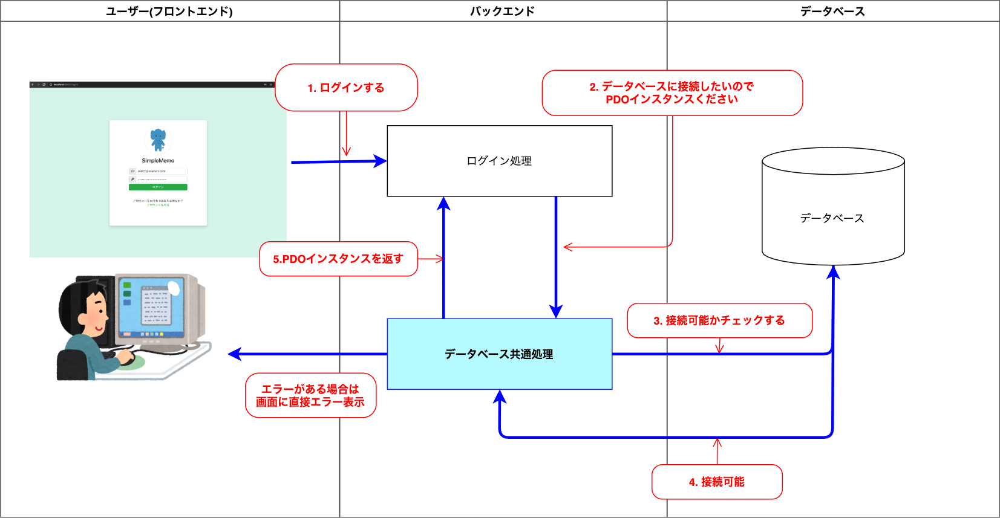

# 第５回：データベース接続関数の作成

作成日: 2025年7月13日 0:25

# 🛠️ データベース接続用の共通関数を作成しよう

このパートでは、**データベースに共通的に接続するための関数**を作成し、プロジェクト全体で再利用できるようにします。

---

## 🎯 本パートの目標物

`common`ディレクトリ配下に、以下のファイルを作成します。

```bash
common/
└── database.php
```

このファイルには、**PDOでMySQLに接続する共通関数**を定義します。

> 📷 イメージ
> 
> 
> 
> 

---

## 📋 作成する処理

この処理は、ログイン機能だけでなく、ユーザー登録画面やメモ投稿画面でも共通的に利用します。

今後データベース操作を行う際には、この関数を呼び出してPDOインスタンスを取得する仕組みにします。

---

## 🛠️ 作成の流れ

作成手順は以下の通りです。

1. お手持ちのエディタで新規ファイルを作成
2. コードを貼り付けて保存
3. 処理内容の解説を確認

それでは、実際に作成を進めていきましょう。

---

## ✍️ 関数を作成する

以下のコードをコピーして新規ファイルに貼り付けます。

### 📄 `common/database.php`

```php
<?php

/**
 * PDOを使ってデータベースに接続する
 * @return PDO
 */
function getDatabaseConnection() {
    try
    {
        $database_handler = new PDO('mysql:host=db;dbname=simple_memo;charset=utf8mb4', 'root', 'password');
    }
    catch (PDOException $e)
    {
        echo "DB接続に失敗しました。<br />";
        echo $e->getMessage();
        exit;
    }
    return $database_handler;
}
```

---

## 💡 getDatabaseConnection関数の解説

この関数の役割やポイントを整理します。

### 🧩 try-catchによるエラーハンドリング

最初に`try-catch`で接続処理を囲みます。

```php
try {
    // データベース接続処理
} catch (PDOException $e) {
    // エラー処理
}
```

接続に失敗した場合は`catch`ブロックでエラーを出力して処理を終了します。

---

### 🧩 PDOのインスタンス生成

`new PDO()`を使って接続します。

```php
$database_handler = new PDO('mysql:host=db;dbname=simple_memo;charset=utf8mb4', 'root', 'password');
```

- `mysql:` : 使用するデータベース
- `host=db` : データベースサーバー（Dockerのサービス名）
- `dbname=simple_memo` : データベース名（前回作成）
- `charset=utf8mb4` : 文字コード

---

### 🧩 エラー処理

接続失敗時には以下が実行されます。

```php
echo "DB接続に失敗しました。<br />";
echo $e->getMessage();
exit;
```

接続エラーの内容を表示して処理を中断します。

---

### 🧩 インスタンスを返す

接続が成功した場合は、生成したPDOインスタンスを返します。

```php
return $database_handler;
```

これで、他のファイルからこの関数を呼び出すだけでDB接続が完了します。

---

## ✅ 完成！

以上で、**共通のデータベース接続関数**の作成が完了しました。

この関数は、今後のログイン処理やメモ管理機能でも活用していきます。