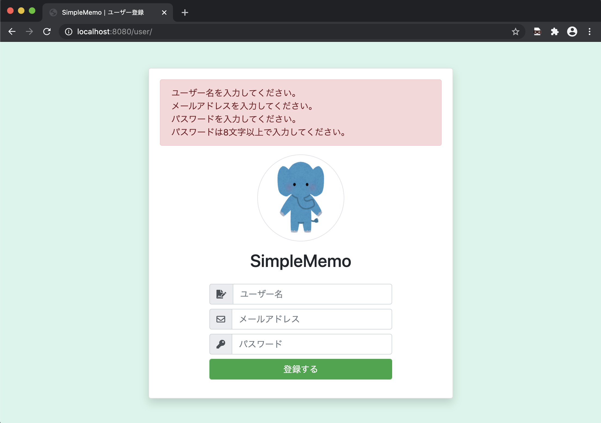

# 第８回：ユーザー登録画面にバリデーションを実装

作成日: 2025年7月26日 15:05

# 🛡️ ユーザー登録画面にバリデーション機能を実装しよう

このパートでは、ユーザーが不正な入力をした際に、エラーメッセージを表示できるようバリデーション機能を実装していきます。

---

## 🎯 本パートの目標

ユーザーが不正な値を入力して「登録する」ボタンをクリックした際に、以下のように**バリデーションエラーを画面に表示**できるようにします。

> 📌 入力エラー例（イメージ）
> 
> 
> 
> 

---

## 🗂️ 実装の流れ

1. `user/action/register.php` にバリデーション処理を実装
2. `user/index.php` にエラー表示のHTMLを追加
3. 動作確認を行う

---

## 🧩 register.php にバリデーション処理を追加

まず、ユーザー登録処理ファイルを開き、**セッションとバリデーション読み込み**を追加します。

```php
<?php
session_start();
require '../../common/validation.php';
require '../../common/database.php';
```

---

### ✅ パラメータ取得後にバリデーションを記述

```php
$user_name = $_POST['user_name'];
$user_email = $_POST['user_email'];
$user_password = $_POST['user_password'];

$_SESSION['errors'] = [];

// 空チェック
emptyCheck($_SESSION['errors'], $user_name, "ユーザー名を入力してください。");
emptyCheck($_SESSION['errors'], $user_email, "メールアドレスを入力してください。");
emptyCheck($_SESSION['errors'], $user_password, "パスワードを入力してください。");

// 文字数チェック
stringMaxSizeCheck($_SESSION['errors'], $user_name, "ユーザー名は255文字以内で入力してください。");
stringMaxSizeCheck($_SESSION['errors'], $user_email, "メールアドレスは255文字以内で入力してください。");
stringMaxSizeCheck($_SESSION['errors'], $user_password, "パスワードは255文字以内で入力してください。");
stringMinSizeCheck($_SESSION['errors'], $user_password, "パスワードは8文字以上で入力してください。");

// 詳細チェック（エラーがない場合のみ）
if (!$_SESSION['errors']) {
    mailAddressCheck($_SESSION['errors'], $user_email, "正しいメールアドレスを入力してください。");
    halfAlphanumericCheck($_SESSION['errors'], $user_name, "ユーザー名は半角英数字で入力してください。");
    halfAlphanumericCheck($_SESSION['errors'], $user_password, "パスワードは半角英数字で入力してください。");
    mailAddressDuplicationCheck($_SESSION['errors'], $user_email, "既に登録されているメールアドレスです。");
}

// エラーがあれば登録画面に戻す
if ($_SESSION['errors']) {
    header('Location: ../../user/');
    exit;
}

```

---

## 💬 エラー表示を index.php に追加

まず、ファイルの先頭にセッションを開始します。

```php
<?php
session_start();
?>

```

次に、HTMLのエラーメッセージ表示領域を `card-body` の直下に追加します。

```php
<?php
if (isset($_SESSION['errors'])) {
    echo '<div class="alert alert-danger" role="alert">';
    foreach ($_SESSION['errors'] as $error) {
        echo "<div>{$error}</div>";
    }
    echo '</div>';
    unset($_SESSION['errors']);
}
?>

```

---

## 🔍 動作確認をしてみよう

### 1. 空のフォームで登録

→ 「ユーザー名を入力してください」などのエラーが表示される


### 2. パスワード7文字で登録

→ 「パスワードは8文字以上で入力してください」


### 3. メールアドレスが不正

→ 「正しいメールアドレスを入力してください」


### 4. 全角のユーザー名・パスワード

→ 「半角英数字で入力してください」


### 5. 同じメールアドレスで登録

→ 「既に登録されているメールアドレスです」


---

## 🧠 なぜサーバーサイドでもバリデーションが必要？

HTML側で `maxlength="255"` のような制限をかけていても、ブラウザの開発ツールなどで改ざんされる可能性があります。

そのため、サーバーサイドでもバリデーションをしっかり書くことがセキュリティの観点からも重要です。

---

## ✅ まとめ

| チェック項目 | 内容 |
| --- | --- |
| 空チェック | 入力されているか？ |
| 最大/最小文字数チェック | 長すぎ or 短すぎないか？ |
| メールアドレス形式チェック | 正しい形式か？ |
| 半角英数字チェック | 不正な文字が入っていないか？ |
| 重複チェック | すでに登録されていないか？ |